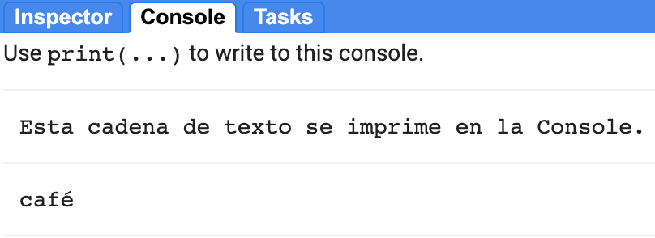
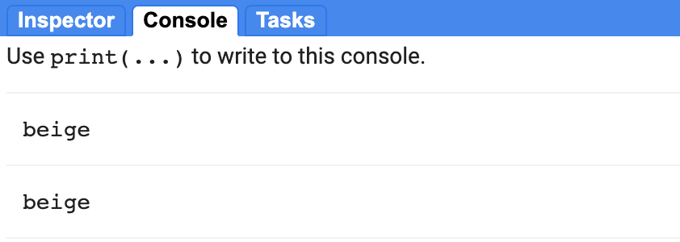
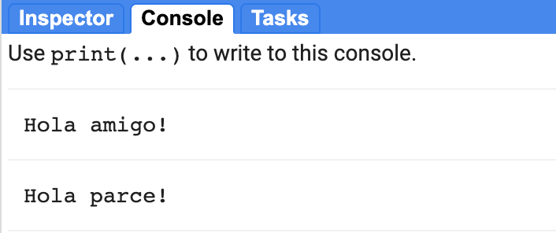
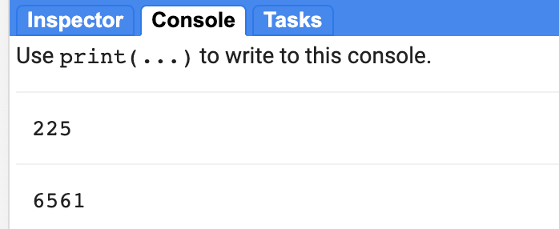

### IALS - 06.10.23

## Pre-requisitos

Por favor, complete este procedimiento antes de realizar los ejercicios prácticos. Siga los pasos que se indican a continuación para registrarse en  Google Earth Engine y únase a nuestro repositorio compartido.

### 1. Registrarse para obtener una cuenta en Google Earth Engine

  - Ir a la [página web de GEE sign up](https://signup.earthengine.google.com/#!/) e ingresar > el correo electrónico que deseas usar para tu cuenta GEE. Una cuenta gmail es la mejor opción.
  - Introduzca su correo electrónico, su afiliación y su región/país. Cuando le pregunte qué desea lograr, mencione que trabaja en una institución dedicada a la investigación.
  - Revise los términos, verifique su identificación de no-robot y haga clic en 'Submit'.
  - Revise su correo electrónico, incluida la carpeta de spam, para ver si hay un enlace del equipo de desarrolladores de Google. El correo electrónico de confirmación tendrá instrucciones sobre cómo acceder al Code Editor.

¿No estás seguro de tener acceso? Utilice [este link](https://code.earthengine.google.com/) para verificar. Si no ha conseguido acceso, recibirá un mensaje indicando un error de autorización, lo cual significa que su cuenta no está registrada. Si tiene acceso, el enlace abrirá el IDE de Javascript. Este enlace constituye su puerta de acceso a GEE.

### 2. Unirse a nuestro repositorio compartido de GEE

GEE permite tener carpetas de grupo compartidas/repositorios para los scripts que vayamos desarrollando. Se ha organizado el código presentado en estas lecciones de la siguiente manera. En lugar de añadir uno a uno los correos electrónicos de los asistentes (¡lo cual es muy tedioso!), se han creado enlaces al repositorio de código compartido. Por favor, siga estos pasos:

<!-- 
  - Únase al grupo de Google Earth Engine SENAMHI haciendo clic en este enlace. <a href="https://goo.gl/JsnWZH" target="_blank">https://goo.gl/JsnWZH</a> . No se preocupe por los permisos de publicación.
 -->
  - Aceptar el repositorio compartido haciendo clic en este enlace:
  <a href="https://code.earthengine.google.com/?accept_repo=users/ivanlizarazo/GEE_BASICO
" target="_blank">https://code.earthengine.google.com/?accept_repo=users/ivanlizarazo/GEE_BASICO</a>
  - En el Code Editor, vaya al **Scripts tab** en el panel superior izquierdo, desplácese hacia abajo y amplíe la sección "Reader". Un directorio llamado *users/ivanlizarazo/GEE_BASICO* debe aparecer con versiones de sólo lectura de los scripts completos de cada sesión.

### 3. Nociones de Javascript 

JavaScript, que no debe confundirse con Java, es un lenguaje de programación ampliamente utilizado en el desarrollo web junto con HTML y CSS. Puede aprender JavaScript usando cualquier tutorial en línea, como los que ofrece <a href="https://www.w3schools.com/js/" target="_blank">w3schools</a> .

A lo largo de las sesiones, accederemos a Google Earth Engine introduciendo comandos de JavaScript en un entorno de desarrollo integrado (IDE) en línea denominado *Code Editor*. No es necesario aprender formalmente JavaScript para trabajar con Google Earth Engine. A continuación te proporcionamos ejemplos y recursos para empezar.  

#### JavaScript básico para GEE

 Aquí hay algunas herramientas útiles para GEE, reproducidos de <a href="https://docs.google.com/document/d/1ZxRKMie8dfTvBmUNOO0TFMkd7ELGWf3WjX0JvESZdOE/edit" target="_blank">Earth Engine 101 Beginner's Curriculum</a>.


// Los comentarios de la línea comienzan con dos barras oblicuas. Como esta línea.

/* Los comentarios de varias líneas comienzan con una barra y una estrella,
y terminan con una estrella y una barra. */


Las variables se usan para almacenar objetos y se definen usando la palabra clave **var**.

// esta es una variable numérica
var theAnswer = 42;

// esta es una variable tipo texto (string) 
var myVariable = 'Yo soy una cadena de texto';

// los objetos string también pueden usar comillas dobles, 
// las comillas no se pueden mezclar ni combinar
var myOtherVariable = "Yo tambien soy una cadena de texto";


Las declaraciones deben terminar en punto y coma, o de lo contrario le aparecerá un aviso.

var test = 'Me siento incompleto...'
var test2 = 'Me siento completo!';


##### Imprimir mensajes y utilizar las listas.


// Los paréntesis se utilizan para pasar parámetros a las funciones
print('Esta cadena de texto se imprime en la Consola.');

/* Los corchetes se utilizan para los elementos de una lista.
El índice cero se refiere al primer elemento de una lista*/
var myList = ['café','azúcar','panela'];
print(myList[0]); // would print 'café'


 

  

##### Uso de diccionarios.


// Los corchetes (o llaves) pueden ser usados para definir diccionarios (key:value pairs).
var myDict = {'alimento':'pan', 'color':'beige', 'número':42};

// Los corchetes se pueden utilizar para acceder a los elementos del diccionario mediante una tecla.
print(myDict['color']);

// O puede usar la notación de puntos para obtener el mismo resultado.
print(myDict.color);


 

  

##### Funciones

Las funciones son una forma de reutilizar el código y facilitar su lectura.

var myHelloFunction = function(string) {
  return 'Hola ' + string + '!';
};
// saludo formal
print(myHelloFunction('amigo'));
// saludo informal
print(myHelloFunction('parce'));


 

  

Esta es otra función

// esta es la definicion
var cuadrado = function(numero){
  return numero*numero;
};
// este es el uso
print(cuadrado(15));
//
print(cuadrado(81));


 

  

#### Quizz práctico

Escriba una función que sume dos números.  Pruebe la función con algunas sumas.

#### Otros recursos JavaScript

El lenguaje JavaScript usa el estilo *camelCase*. JavaScript (según la academia W3) es fácil de aprender. Como otros lenguajes de programación, puede usar guías de estilo para aprender a escribir código estándar y reproducirlo.

Google tiene su propia guía de estilo <a href="http://google.github.io/styleguide/jsguide.html" target="_blank">Guía de estilos JavaScript</a>.
<!--
Dana Tomlin también ha creado <a href="https://drive.google.com/file/d/0B3H1GYZLzLKCckwwVjZfVmdPNDA/view)" target="_blank">JavaScript Quick Start Guide</a> que sólo toma unos pocos minutos de trabajo, pero que tiene algunos aspectos básicos. Puedes encontrarlo haciendo clic en ese enlace o yendo a la página principal de GEE, haciendo clic en la pestaña EDU en la parte superior izquierda, y bajando a la sección de Ejercicios de Diseño de Software Geoespacial.
-->

 

  
