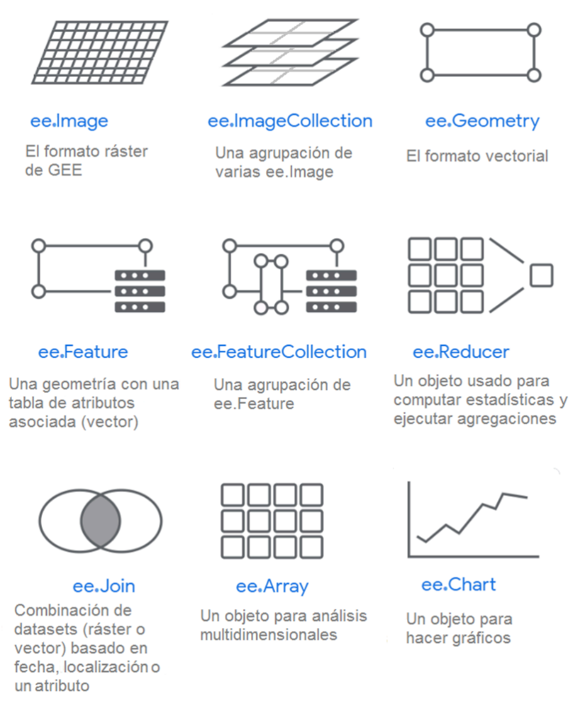
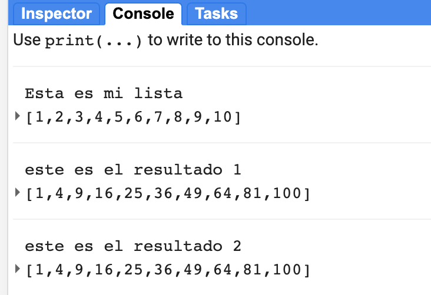

### IALS - 06.10.23

## ¿Qué es Google Earth Engine?

Gorelick et al. (2017) indican en su articulo publicado en la revista *<a href="http://www.sciencedirect.com/science/article/pii/S0034425717302900" target="_blank">Remote Sensing of the Environment</a>*:

> Google Earth Engine es una plataforma basada en la nube para trabajos a escala planetaria
> que presenta capacidades para realizar análisis geoespacial 
> y proporciona el poder computacional de Google.
> Provee de capacidades para incidir en una variedad de cuestiones sociales de gran impacto
> incluyendo la deforestación, las inundaciones, la sequía, los desastres naturales, las enfermedades y la > seguridad alimentaria, la gestión del agua, el monitoreo climático y la protección ambiental.

## ¿Por qué usar Google Earth Engine?

Google Earth Engine permite a los usuarios manejar petabytes de datos sobre la marcha sin tener que navegar por las complejidades de la paralelización basada en la nube. La mejora del acceso inclusivo ha estimulado el crecimiento de la observación de la Tierra a escalas antes inimaginables.

#### Razón # 1: Ciencia a escala planetaria

Desde que GEE entró en funcionamiento, han surgido varios estudios innovadores que demuestran el poder de la computación a gran escala para incidir en los problemas ambientales y sociales. Los siguientes tres ejemplos muestran la base de datos, las publicaciones de alto impacto y los exploradores web que se han generado a partir de las investigaciones realizadas en esta plataforma.

***
> **Caso 1: Monitoreo global de bósques**

Lanzado en el año 2013, <a href="http://www.globalforestwatch.org/" target="_blank">Global Forest Watch</a> fundamentalmente cambió nuestra comprensión de la pérdida de bosques a escala planetaria. Esta herramienta de monitoreo y conservación de los bosques muestra interactivamente la ganancia y la pérdida de los bosques a escala mundial. La base de datos subyacente de la deforestación de Hansen está disponible en Google Earth Engine y aprovecha más de 3 millones de imágenes de Landsat para trazar un mapa de la dinámica mundial de los bosques.

Puede obtener más información aquí:

  - <a href="http://science.sciencemag.org/content/342/6160/850" target="_blank">High-Resolution Global Maps of 21st-Century Forest Cover Change</a> es la publicación original de Hansen, et al (2013).

  - <a href="https://developers.google.com/earth-engine/tutorial_forest_01" target="_blank">Hansen Tutorial for GEE</a> consituye una serie de tutoriales para aprender GEE, orientados a principiantes.

*Forest loss in Sumatra's Riau province, Indonesia, 2000-2012. Credit: Hansen, Potapov, Moore, Hancher et al., 2013*

***
> **Caso 2: Variabilidad espacial, a escala global, de los cuerpos de agua superficial**

En 2016 el centro de investigación *European Commission's Joint Research Centre* (EC-JRC) publicó una base de datos denominada Global Surface Water Occurrence, que muestra la intensidad del cambio en la ocurrencia de aguas superficiales a escala global. En resumen, los autores cartografiaron la pérdida y la ganancia de cuerpos de agua a escala mundial desde 1984.

  - <a href="https://www.nature.com/articles/nature20584" target="_blank">High-resolution mapping of global surface water and its long-term changes</a> - El artículo original publicado en *Nature*.

  - Tutorial en línea para revisar los datos:  <a href="https://developers.google.com/earth-engine/tutorial_global_surface_water_01" target="_blank">Global Surface Water Tutorial for GEE</a>

  - El <a href="https://global-surface-water.appspot.com/" target="_blank">Global Surface Water Data Explorer</a> que se publicó junto con la base de datos para permitir a los usuarios visualizar los cambios en los cuerpos de aguas superficiales.

  - Un <a href="https://storage.googleapis.com/global-surface-water/downloads_ancillary/DataUsersGuidev2.pdf" target="_blank">Data Users Guide</a> describiendo la base de datos en detalle.  

***

> **Caso 3: Tiempo de viaje a escala global**

El proyecto *Oxford Malaria Atlas*, el centro EC-JRC  y la University of Twente se unieron para crear un mapa de los tiempos de viaje desde cualquier punto del mundo hasta el centro urbano más cercano. Este trabajo permite localizar áreas con poco acceso a servicios para informar los esfuerzos de salud pública y las decisiones políticas.

  - <a href="https://www.nature.com/articles/nature25181" target="_blank">A global map of travel time to cities to assess inequalities in accessibility in 2015</a> - El artículo original publicado en *Nature* describe la distribución de los tiempos de viaje al área de densidad de población más cercana desde cualquier punto del globo.

  - Un <a href="https://map.ox.ac.uk/research-project/accessibility_to_cities/" target="_blank">website</a> ha sido publicado en conjunto con el artículo.

  - Algunos ejemplos de<a href="https://code.earthengine.google.com/d52c656d3098b2723b275cc0d113d05e" target="_blank">GEE scripts</a> para visualizar dicha información.

***

#### Razón # 2: Procesamiento gratuito en la nube usando una variedad de funciones preestablecidas

Google Earth Engine está diseñado para el análisis de datos geoespaciales utilizando cloud computing. GEE se encarga de toda la infraestructura computacional y la paralelización por el usuario. Estas operaciones se denominan "server-side".

Usando GEE, se puede llamar a un amplio conjunto de funciones que han sido desarrolladas específicamente para la computación en Earth Engine y aplicarlas sobre muchas imágenes simultáneamente usando la infraestructura computacional de Google. Así se evitan descargas y el análisis local de los mosaicos individuales a la vez o el costo de su almacenamiento local.

#### Razón # 3: Archivo online de datos públicos

El catálogo GEE alberga múltiples petabytes de imágenes satelitales en la nube, incluyendo toda la misión Landsat. Otras misiones de sensoramiento remoto incluyen Sentinel-1, Sentinel-2, MODIS y otros productos. Además de las imágenes, GEE también alberga bases de datos de productos de precipitación, densidad poblacional, topografía, cobertura de suelos y el clima. Se añaden diariamente más de 6000 escenas de misiones satelitales activas.
  - La <a href="http://www.sciencedirect.com/science/article/pii/S0034425717302900" target="_blank">Tabla 1</a> in Gorelick et al. (2017) describe las bases de datos frecuentemente usadas.
  - El sitio<a href="https://earthengine.google.com/datasets/" target="_blank">Google Earth Engine</a> presenta una descripción general de la base de datos.
  - Se puede navegar directamente por la base de datos a través de la <a href="https://explorer.earthengine.google.com/#index" target="_blank">API de Google Earth Engine</a>.

 

  

#### Razón # 4: Cargar su propio catálogo de datos

Se pueden subir  datos raster **y** vectorial a la plataforma. También se puede recomendar  agregar otros datos desde la ventana del Code Editor de la API de Javascript yendo al botón *Help* en la parte superior derecha y seleccionando *Suggest a dataset*.

 

  

#### Razón # 5: GEE se encarga del control de versiones

GEE hace una copia de seguridad del código en un repositorio git sin que los usuarios tengan que preocuparse por ello. Se pueden compartir esos repositorios con otros usuarios y ver versiones anteriores de los scripts fácilmente desde el *Code Editor*.

#### Razón # 6: Acceso flexible a través de Application Programming Interface (API)

El equipo de desarrollo de GEE trabaja para hacer que la plataforma sea de fácil acceso. Se puede acceder a Google Earth Engine a través de diferentes canales, incluyendo una interfaz gráfica de usuario no programada, la API de JavaScript y la **API de Python**.

  - El <a href="https://explorer.earthengine.google.com/#workspace" target="_blank">Google Earth Engine Explorer</a> es genial para que personas sin conocimientos previos visualicen las bases de datos disponibles, pero tiene capacidades limitadas para el análisis.
  - La interfaz gráfica de JavaScript es una plataforma web en la que se puede hacer requerimientos a través de la API principal de GEE. Los desarrolladores han pasado años perfeccionando esta plataforma para facilitar a los usuarios el almacenamiento, el intercambio y la versión de los resultados del código, la ejecución de tareas y, lo que es más importante, la visualización de los resultados sobre la marcha en gráficos y mapas renderizados directamente en la ventana del navegador. También se encargan de la autenticación del usuario con sólo iniciar sesión a través de su gmail.
  - La **API de Python** requiere que los usuarios se encarguen de la autenticación y la visualización de los resultados, con el beneficio de permitir a los usuarios personalizar más plenamente los requerimientos más allá de la biblioteca de funciones disponibles de forma nativa en GEE. No hay ningún sitio web al que se acceda para realizar el análisis: el código se construye desde cero utilizando flujos de trabajo que se desarrollan de forma individual.

Para estas lecciones vamos a utilizar el JavaScript API, sin embargo el <a href="https://developers.google.com/earth-engine/python_install" target="_blank"> material de entrenamiento para acceder a GEE usando Python</a> está ahora disponible en la website de GEE. Si está interesado en usar el Python API, hay que seguir las instrucciones mostradas en el link para la instalación y revisar los *notebooks* de ejemplo <a href="https://github.com/renelikestacos/Google-Earth-Engine-Python-Examples/ " target="_blank">aquí</a>. La Javascript API ha incorporado herramientas de visualización de mapas, así que eso es lo que usaremos para aprender como usar la plataforma inicialmente.

Si todavía no está seguro de para qué sirve GEE, puede revisar la siguiente presentación <a href="https://docs.google.com/presentation/d/1hT9q6kWigM1MM3p7IEcvNQlpPvkedW-lgCCrIqbNeis/edit#slide=id.gf251d1053_0_1005" target="_blank">What is Google Earth Engine?</a> disponible del equipo GEE.

***

## ¿Cómo interactuamos con la plataforma?

Usando el *Code Editor*, se escriben comandos que son enviados como un objeto a Google para ser procesados en paralelo en la nube (server-side). Los usuarios pueden visualizar los resultados de Google en su navegador (client-side), incluyendo objetos como mapas, gráficos o resultados estadísticos.

Utilizando una de las API, los usuarios pueden filtrar enormes colecciones de imágenes a las fechas y áreas de su interés, asignar algoritmos sobre colecciones de imágenes, aplicar algoritmos a imágenes individuales o colecciones de imágenes y estimar estadísticos a través del tiempo y el espacio sin tener que descargar una sola imágen a su computadora.

 

  

## Objetos en GEE

Existen dos lados de programación en GEE: el lado del servidor y el lado del cliente. Un objeto puede ser convertido entre los dos tipos (p.ej. una cadena de texto). Igualmente, algunas operaciones se pueden realizar usando objetos de los dos lados, siempre y cuando se use la sintaxis apropiada. 

 

  

Hay que tener en cuenta que la mayoría de las veces hay que usar la programación del lado del servidor ya que es allí donde se realiza la mayoría de los procesos.

### Tipos de objetos del lado del servidor

 

  

Cada uno de los objetos del lado del servidor (p.ej. ee.ImageCollection, ee.Image, ee.Geometry, eee.Feature, ee.FeatureCollection) tiene sus correspondientes métodos. Mas informacion se encuentra
<a href="https://developers.google.com/earth-engine/guides/objects_methods_overview" target="_blank">aquí</a>.

### JavaScript con objetos del servidor

En esta sección seguimos conociendo un poco más de JavaScript en GEE.

Se puede crear una lista de números así:

// This generates a list of numbers from 1 to 10.
var myList = ee.List.sequence(1, 10);
print('esta es mi lista, myList);


Esta es una función rudimentaria que utiliza la instrucción *FOR* para elevar al cuadrado cada item de una lista:

// El metodo de iterar una colección de objetos usando FOR  
// no se recomienda al programar en GEE 

// Esta es una funcion que utiliza la instruccion FOR
// para elevar al cuadrado cada item de una lista

var computeSquares1 = function(lista){
    var nueva_lista = ee.List([]);
    var n = ee.List(lista).size().getInfo();
    for (var i = 0; i < n; i += 1) {
      var old_value = ee.List(lista).get(i);
      var new_value = ee.Number(old_value).pow(2);
      nueva_lista = nueva_lista.insert(i, new_value);
    }
   return nueva_lista;
};

// Uso de la funcion en la lista
var squares1 = computeSquares1(myList);
print('este es el resultado 1', squares1);


Esta es una función simple que utiliza el método *.map* para operar en una colección de objetos:

// El método map() toma una función que trabaja en cada elemento
// de manera independiente y retorna un valor.
// Esta función calcula el cuadrado de cada número
var computeSquares2 = function(number) {
  return ee.Number(number).pow(2);
};
// Ahora se aplica la función a cada elemento de la lista:
var squares2 = myList.map(computeSquares2);
print(squares2);  


 

  

##### Quizz práctico

Escriba una función que permita realizar la multiplicación de cada  elemento de una lista por cualquier número.  Pruebe la función con varias multiplicaciones.

## Resumen

### ¿Cuáles son los usos comunes de GEE?

- operar en petabytes de imágenes usando los servidores en la nube de Google
- incluir los resultados en aplicaciones
- almacenar, compartir y controlar la versión de los scripts
- importar y exportar sus propios datos raster y vectoriales (assets)
- compartir sus propios datos raster y vectoriales
- exportar sus análisis

### ¿Para qué no ha sido diseñado GEE?

- elaboración de cartografía
- realizar procesamiento de datos vectoriales
- Paralelización DIY. Como se indica en Gorelick et al. 2017, "The price of liberation from these details [of parallelization] is that the user is unable to influence them.”

### ¿Cuáles son los dos tipos de objetos en la programación GEE?

- Los objetos del lado del cliente son contenedores que le indican al servidor qué se puede hacer o no con ellos.
- Los objetos del lado del servidor tienen un nombre que empieza por *ee.*
- Los objetos del lado del servidor tienen una documentación detallada de los métodos y funciones asociadas

