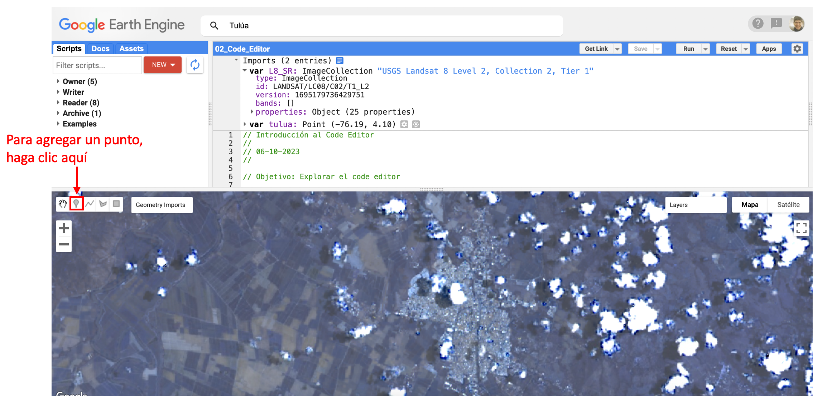
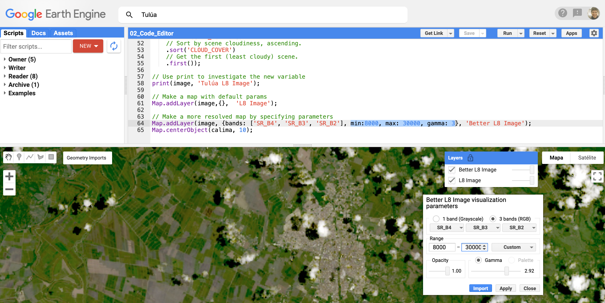
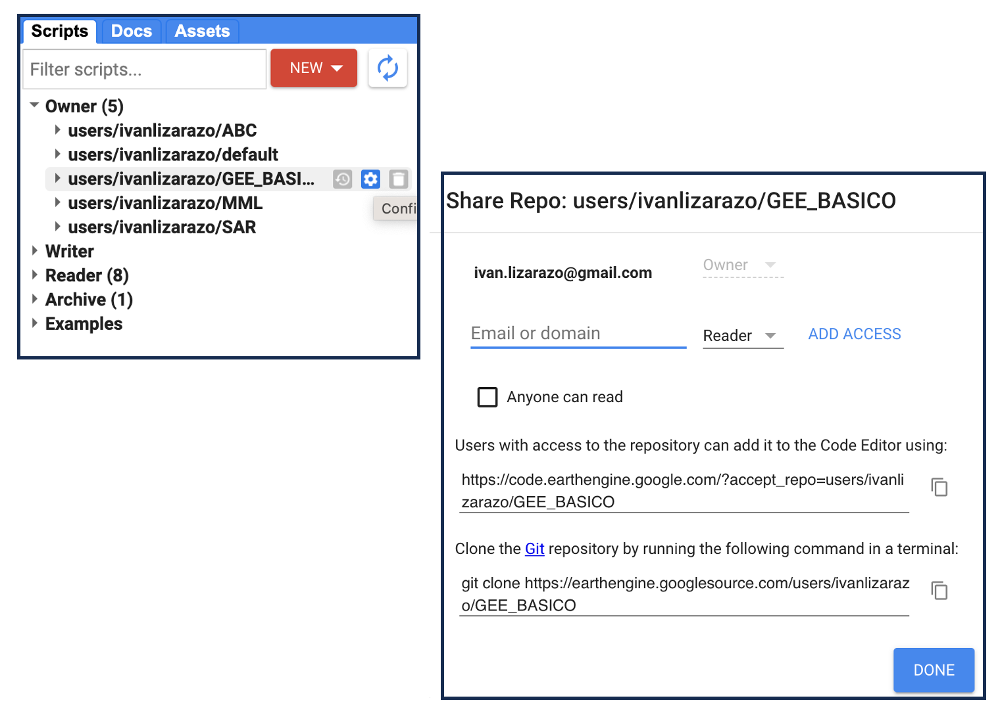

### IALS - 06.10.23

# Vista general del Editor de Código

GEE tiene un entorno de desarrollo integrado (IDE) llamado Editor de código (*Code Editor*). El Editor de código tiene varias características para ayudar a hacer más fácil la programación en este entorno que exploraremos en este tutorial. Para una descripción exhaustiva, véase el <a href="https://developers.google.com/earth-engine/playground#api-reference-docs-tab" target="_blank">Earth Engine Code Editor help page</a> en las guías de usuario de GEE. 

# Ejercicios: Exploración del Code Editor

## 1. Para empezar

**Para acceder al Code Editor, escriba la siguiente url en su navegador: <a href="https://code.earthengine.google.com" target="_blank">https://code.earthengine.google.com</a>**. Debería aparecer una interfaz de programación web como la siguiente. El siguiente diagrama tiene anotaciones que apuntan a muchas de las funcionalidades que cubriremos hoy.

 

  

#### La ventana del JavaScript Code Editor

El código Javascript está escrito en esta ventana. El editor también tiene algunas funciones de ayuda, incluyendo autocompletar para las funciones GEE, autocompletar para los paréntesis, etc. y algunas sugerencias básicas de subrayado y sintaxis.

Por ejemplo, se pueden escribir comentarios usando una doble barra. Escriba lo siguiente en su editor y haga clic en el botón "Run".


// Esto es sólo un comentario.


#### La pestaña de la consola

También se puede usar `print()` para mostrar los objetos en la consola. Escriba esto y haga clic en "Run":


// Imprime algo en la consola
print("Hola Mundo!");


#### Sugerencia automática

El editor marcará las declaraciones incompletas con una **`i`**, es decir si olvida escribir el punto y coma al final de cada línea. 


print("Hola Mundo!")


 

## 2. Guardar y compartir Scripts

#### Guardando Scripts

Guarde los scripts haciendo clic en el botón **Save**. Para incluir un mensaje de confirmación, usar la flecha desplegable y selecciona "Save with a description".  Los mensajes se almacenan en el historial de revisiones de cada script guardado.

 

  

*Note: Si no realizó ningún cambio en el script, el botón* **Save** *se oscurecerá.*

Si se observa en el panel superior izquierdo, se podrá ver que el script está ahora guardado en tu gestor de **Scripts**. Tienes tres categorías de scripts: privado, compartido y ejemplos. Cada script está respaldado en Git. Si pasas el ratón por encima del nombre del script, aparecerán tres iconos que te permitirán volver a versiones anteriores, renombrar o eliminar el script. También puedes crear carpetas y hacer clic y arrastrar los scripts a esos directorios.

*Nota/advertencia: Si cambias el nombre de un script, su historial de revisiones desaparece.*

#### Compartiendo Scripts

Se puede compartir una versión estática de los scripts haciendo clic en **Get Link**. Aparecerá una url en el campo de dirección de tu navegador. Comparte este enlace para dar a otras personas acceso a tu script como *it is*. Si continúas haciendo ediciones en este script, no se actualizarán en la versión enlazada. Esta opción es útil para compartir ejemplos e instantáneas de scripts con otras personas.

    **Consejo importante: Cuando se publique en el foro de ayuda, incluya SIEMPRE el enlace de su script para que la gente pueda ayudarte a solucionar el
	problema. Asegúrese de que todos los assets personales que utilice sean compartidos para que el script se ejecute para otros.**

#### Únase al repositorio compartido

Para colaborar de forma interactiva en el desarrollo de los scripts con otros usuarios, puede crear una carpeta compartida, invitar a sus colaboradores y colocar los scripts en esa carpeta. Hemos creado una carpeta compartida para el desarrollo de este curso.

Usted debería de haber accedido al repositorio de scripts compartidos en el Code Editor con los siguientes pasos:

<!-- 
  - Únase al grupo de Google Earth Engine SENAMHI haciendo clic en este enlace. <a href="https://goo.gl/JsnWZH" target="_blank">https://goo.gl/JsnWZH</a> . No se preocupe por los permisos de publicación. -->
- Acceder al repositorio compartido haciendo clic en este enlace: <a href="https://code.earthengine.google.com/?accept_repo=users/ivanlizarazo/GEE_BASICO" target="_blank">https://code.earthengine.google.com/?accept_repo=users/ivanlizarazo/GEE_BASICO</a>
- En el Code Editor, vaya a la pestaña **Scripts** en el panel superior izquierdo, desplázate hacia abajo y expande la sección "Shared". Un directorio llamado *GEE_BASIC0* debería aparecer con versiones de sólo lectura de los scripts completos de cada episodio.

Cualquier actualización se reflejará en estas versiones del script. Como todos los scripts GEE, estas son versiones controladas. Los permisos de lectura o escritura para individuos o grupos se pueden establecer en el Code Editor usando el pequeño icono gris de compartir que aparece a la derecha si pasas el ratón por encima del nombre del directorio en la pestaña *Scripts*. Deberías tener acceso de sólo lectura a este repositorio.

 

## 3. Acceso a los datos de la nube de Google

#### Barra de herramientas de búsqueda: Encontrar un conjunto de datos raster y cargarlo como `ImageCollections`

Para consultar el <a href="https://code.earthengine.google.com/datasets/" target="_blank">catálogo de datos GEE</a>, se pueden introducir palabras clave en la barra de búsqueda en la parte superior del Code Editor.

Para practicar, carguemos algunas imágenes en el Code Editor. Vamos a buscar e importar el producto **Landsat 8**.
  - Para hacer esto, ve a la barra de herramientas *Search* y escribe **Landsat 8 Level 2**.
  - Seleccione la base de datos - USGS Landsat 8 Level 2 Collection 2 Tier 1- haciendo clic en el nombre. Esto cargará los metadatos para esta colección de datos. Puedes confirmar que tienes el correcto porque el "ImageCollection ID" debe decir **LANDSAT/LC08/C02/T1_L2**
  - Ahora, haz clic en **Import** en la ventana emergente. Una nueva variable (`ImageCollection`) se cargará en el panel "Imports" en la parte superior del Code Editor.
  - Renombre este objeto como "L8_SR". Este objeto es una `ImageCollection` de imágenes en el nivel de procesamiento 2, lo que significa que es una *pila* de imágenes. Fíjese que tenemos que declarar este objeto usando *var*. Si haces clic en el pequeño icono cuadrado azul encima de la colección, aparecerá un ventana emergente mostrando el código que se acaba de crear.


var L8_SR = ee.ImageCollection("LANDSAT/LC08/C02/T1_L2")


Para ver la colección, intente imprimirla como se hizo con el objeto string.


print(L8_SR);


**¿Qué ocurre?**

Earth Engine se demora - esto significa que la petición es demasiado grande, lo que tiene sentido ya que hay miles de imágenes en la colección de Landsat 8. Para evitar esto, intenta lo siguiente:


print(L8_SR.limit(5))


Esto mostrará sólo los metadatos de las primeras cinco imágenes de la colección. Puede ver el ID de la colección, las bandas, las características, cuáles son las imágenes de la colección, las bandas de cada imagen y sus propiedades.

*Nota: Los desarrolladores siempre están agregando nuevas funcionalidades a la interfaz gráfica de usuario para que no tengamos que codificar. Como resultado, a veces habrá un método de apuntar y hacer clic para hacer algo que también se puede lograr escribiendo una o dos líneas de código. La función de "import" es un gran ejemplo de esto porque se puede importar una colección usando el botón "Import" en los metadatos o el comando "ImageCollection" escrito en JavaScript. Lo mismo, de dos maneras.*

#### Seleccionar un área de estudio usando la herramienta Geometry

Las herramientas de dibujo geométrico situadas en la parte superior izquierda del visor de mapas pueden utilizarse para crear manualmente puntos, líneas o polígonos. Ahora vamos a definir un área de estudio usando un punto que seleccionamos en el mapa. Utilizaremos las **Geometry Tools** para crear ese objeto.

1. Escriba "Tulúa, Valle del Cauca" en la barra de herramientas de búsqueda y pulse intro. Nos debería de llevar a dicha ciudad.
2. En el lado izquierdo del mapa, haz clic en el pequeño icono del marcador. El cursor se convertirá en una cruz.
3. Mueva el cursor en el mapa y ubíquelo en el centro de la ciudad.
4. Ahora, ve a la ventana Geometry Imports que ha aparecido. En esa ventana, cambie el nombre el punto a "tulua" y modifique el desplegable de **Geometry** a **FeatureCollection**.

Ahora ha creado un nuevo objeto con geometría de punto (un *feature*) y lo ha cargado como una `FeatureCollection`. Ahora puede usar esta `FeatureCollection` como una forma de filtrar geográficamente conjuntos de datos sólo para la región de interés.

 

  

#### Filtrar la Image Collection

Uno de los mayores beneficios de la API de JavaScript  es la capacidad de visualizar rápidamente  imágenes de entrada y los resultados que se vayan obteniendo. Ahora vamos a visualizar una imagen de la colección de Landsat 8.

Vamos a filtrar la colección a una imagen por:

  - nuestra área de estudio que hemos definido con un punto
  - sólo un año de imágenes (2022)
  - clasificando las imágenes por la cobertura total de nubes (de menos nubes a más nubes)
  - eligiendo la imágen superior (menos nublada)

En esencia, esto nos permite ordenar la colección completa de Landsat 8 y cargar la mejor imagen disponible para nuestra región de interés para el 2022.


// Cargar imágenes de Landsat 8
var image = ee.Image((L8_SR)
    // Filter to get only images under the region of interest.
    .filterBounds(tulua)
    // Filter to get only one year of images.
    .filterDate('2022-01-01', '2022-12-31')
    // Select just the optical bands
    .select(['SR_B[1-7]'])
    // Sort by scene cloudiness, ascending.
    .sort('CLOUD_COVER')
    // Get the first (least cloudy) scene.
    .first());



Usa una declaración para imprimir los metadatos de la imagen que acabamos de obtener:


print(image, 'Tulua L8 image')


Ahora hemos filtrado TODO el archivo de Landsat 8 para obtener la imagen menos nublada para nuestra área de estudio en 2022. Sin embargo, todavía tenemos que visualizarla, lo que haremos usando la función `Map.addLayer`.

*Nota: ¿No está seguro de lo que hace esta función? Búscala en la pestaña* **Docs** *para aprender los argumentos.*


Map.addLayer(image,{},  'L8 Image');


#### Gestionar las capas

El mapa no luce tan bien. Definamos qué bandas usar y completemos algunos otros parámetros de visualización usando el administrador de capas. Usaremos la reflectancia en el rango visible desde el rojo (Banda 4), el verde (Banda 3) y el azul (Banda 2) para hacer una imagen de color verdadero.  Podemos usar los conocimientos previos para hacer una imagen que luzca mejor:


Map.addLayer(image, {bands: ['B4', 'B3', 'B2'], min:8000, max: 30000, gamma: 3}, 'Better L8 Image');


Aunque a menudo no es posible conocer el mínimo, máximo y el valor de gamma óptimos. Para ello sirve la herramienta **Layer Manager** que se encuentra en la esquina superior derecha del mapa. Esta herramienta le permitirá activar o desactivar las capas, así como ajustar su transparencia y configurar interactivamente los parámetros de visualización de cada capa. Puede usar esta herramienta para averiguar qué parámetros pasar al `Map.addLayer`.

 

  

También puede cambiar entre los botones **Map** o **Satellite** en la parte superior derecha del panel del mapa para cambiar la capa base.

Para más información sobre la visualización de imágenes, vea el <a href="https://developers.google.com/earth-engine/image_visualization" target="_blank">GEE Visualization Guide</a> o la <a href="https://developers.google.com/earth-engine/tutorial_api_02" target="_blank">GEE Visualization tutorial</a>.

#### La pestaña Inspector

Otra forma de inspeccionar y explorar una imagen es a través de la herramienta de inspección. La consola del Inspector le permite consultar el mapa de forma interactiva. Si tienes la imagen cargada, GEE dará información sobre esa imagen en el punto en el que se hizo clic.

En la parte superior derecha, cambie a la pestaña **Inspector** y haga clic en el mapa donde hay tierra. Ahora haga clic donde hay agua. Cambie entre el gráfico y la lista de valores.

## SIGAMOS PRACTICANDO

Practique por su cuenta con los parámetros de visualización y utiliza el Inspector para explorar el mapa, haciendo clic sobre el Valle del Cauca, las ciudades, los cultivos, los bosques y el agua. Tome nota de los valores de reflectancia de las diferentes bandas en cada tipo de cobertura.

Si ya ha ejecutado las instrucciones indicadas anteriormente, practique cambiando las fechas de interés  y obteniendo la imagen menos nublada de la zona de interés en ese periodo.

También puede obtener  imágenes para dos épocas diferentes y  observar si existen cambios en la reflectancia de diferentes coberturas  de acuerdo con la época del año.

## 4. Obtener ayuda

Hay muchas formas de conseguir ayuda en el Code Editor. Familiarizarse con estas herramientas puede ayudar en el aprendizaje.

#### Referencia API (pestaña Docs)

Al lado de la pestaña **Scripts** está la pestaña **Docs**, que tiene la documentación completa y buscable de la API de JavaScript para cada función. La documentación está organizada por tipo de datos GEE. Cada tipo de datos tiene un conjunto específico de funciones que se pueden aplicar a él.

#### El botón Help

El botón **Help** es una puerta de entrada a muchos recursos, incluyendo enlaces a:

 - el <a href="https://developers.google.com/earth-engine/" target="_blank">**Developers Guide**</a>
para los tutoriales, referencias y guías oficiales de GEE. Este es el primer lugar al debe ir cuando necesite buscar cómo escribir un código.

 - el **Help Forum** donde puede publicar preguntas y obtener respuestas. Si no puede encontrar una guía para mi pregunta específica en las Guías GEE, entonces busque palabras clave de su problema/pregunta en el foro. Como la gente comparte enlaces a sus códigos, a menudo se encuentran buenos ejemplos de soluciones allí.

 -  <a href="https://developers.google.com/earth-engine/tutorials" target="_blank">Existing tutorials</a> y la <a href="https://developers.google.com/earth-engine/edu" target="_blank">Earth Engine for Higher Education resources</a> escrito por el equipo de GEE y otros (¡incluso algunos en japonés!)

 - Una lista de atajos de teclado

 - enlaces a la página de **Suggest a Dataset**

#### Ejemplos en el **Shared Scripts**

Un último lugar donde puede obtener ayuda es desplazándose hacia abajo y mirando los ejemplos que se encuentran en el **Shared Scripts** en la pestaña **Scripts**.  

 

## 5. Importar y exportar sus propios Assets

#### Importar imágenes y archivos vectoriales

Además de usar todos los increíbles archivos de Google, los usuarios también pueden importar sus propios datos como imágenes (rasters) o tablas (vectores). La pestaña **Assets** de la izquierda es donde se pueden importar, compartir y administrar estos propios activos. Puede subir imágenes o tablas (datos vectoriales) allí.

 

  

Para obtener instrucciones detalladas de Google sobre cómo subir, compartir y administrar activos, consulte el <a href="https://developers.google.com/earth-engine/asset_manager" target="_blank">Assets Manager page</a> en el sitio web de GEE.

#### Exportando y la pestaña Tasks

En lugar de imprimir en la consola, para tareas más grandes puede que quieras exportar las salidas a su Google Drive o Cloud Storage usando las funciones `Export` en su código. Cuando se ejecutan, estas generan una nueva tarea en la pestaña `Task` en el panel superior derecho. Necesitará entonces "Run" esta tarea para iniciar realmente la transferencia de información. Una vez que inicie una tarea, se le pedirá que introduzca los detalles sobre la resolución, tamaño, formato y destino si no lo incluyó en su código. Puede pasar el ratón por encima de la tarea y hacer clic en el icono "?" para ver el estado y también para obtener el número de la tarea. Si su tarea no se está ejecutando, puede compartir este número como referencia en el foro de desarrolladores.

Exportaremos información vectorial en <a href="https://ials.github.io/GEE_BASICO/03-load-imagery/" target="_blank">Leccion 03 Cargar Imágenes</a> de este tutorial.

Para instrucciones detalladas sobre Export, véase la <a href="https://developers.google.com/earth-engine/exporting" target="_blank">Exporting Data page</a> en el sitio web de GEE. También presentaremos algunos ejemplos para exportar en sesiones posteriores.

 
 

Enlace del código completo usado en esta lección:
<a href="https://code.earthengine.google.com/785e05ebeb16b45744b860935a98ffab" target="_blank">https://code.earthengine.google.com/785e05ebeb16b45744b860935a98ffab</a>

### Practique con el Code Editor!!!
