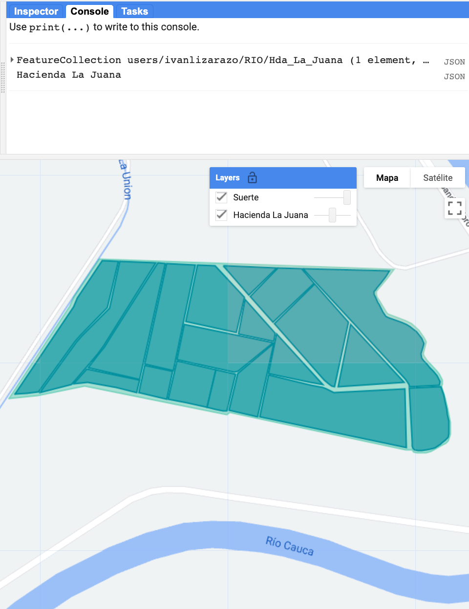
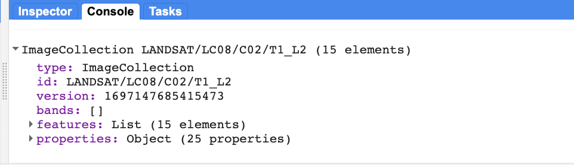
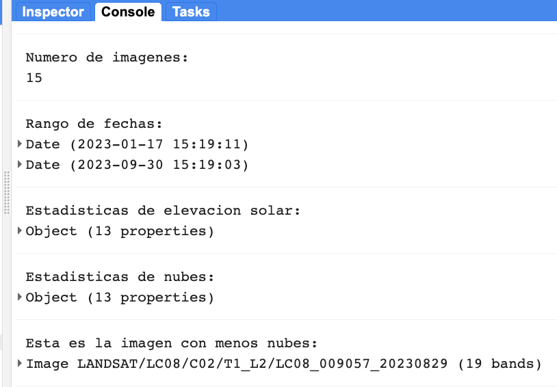
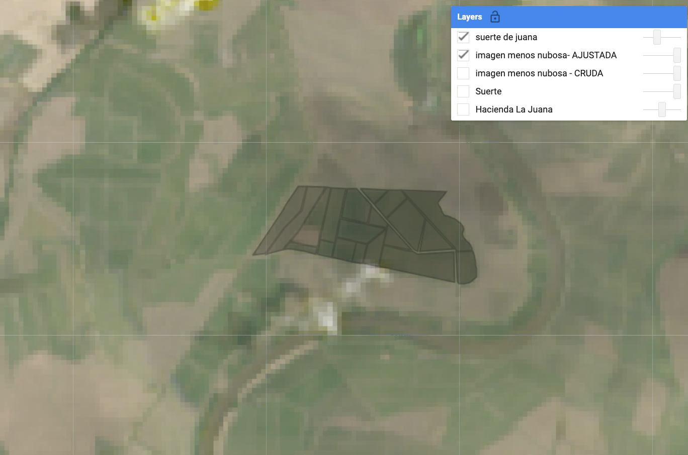
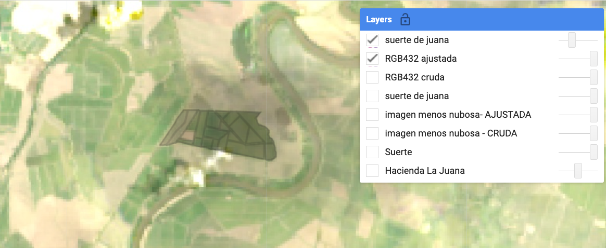
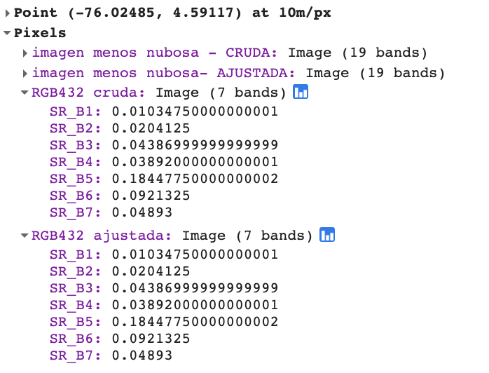
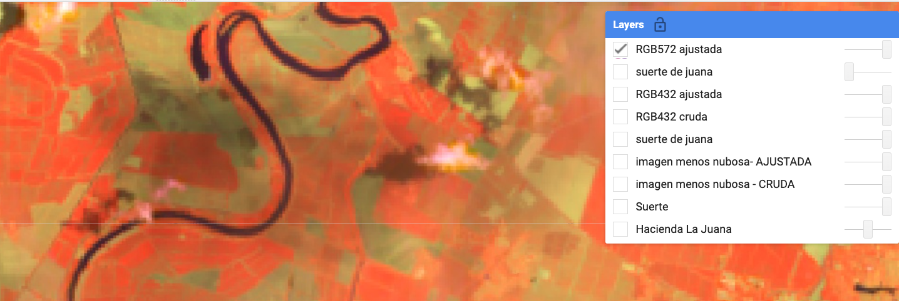
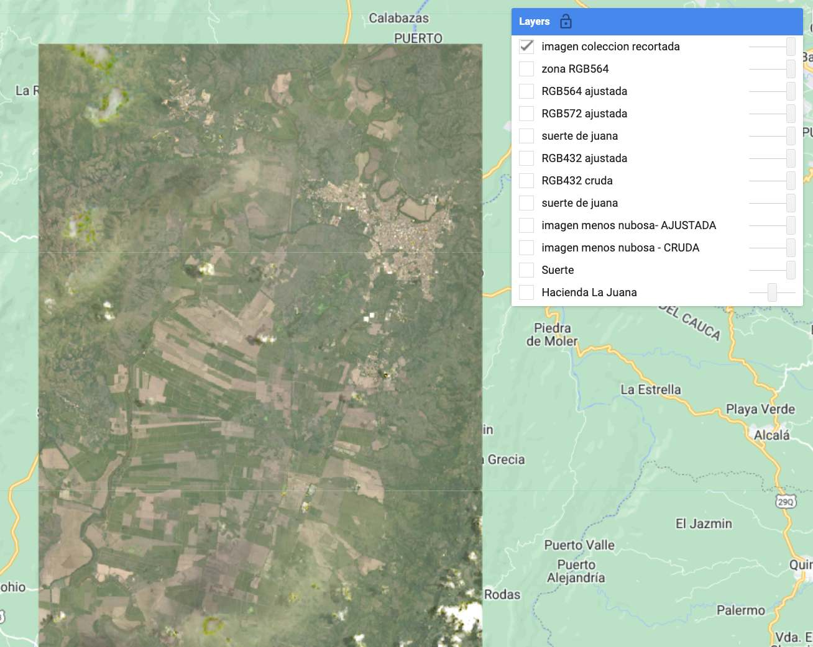

## IALS - 17.10.2023

# Descripción general: Imágenes Landsat

Los datos globales de Landsat se dividen en escenas de ~180 km2, con identificadores únicos de path/row. *<a href="https://www.sciencedirect.com/science/article/abs/pii/S0034425715302194" target="_blank">Wulder et al. (2016)</a>* indican  que cada escena Landsat es obtenida cada 16 días  (aproximadamente 45 veces al año). Los bordes de cada escena se superponen, proporcionando una mayor frecuencia temporal en estas áreas. Sin embargo, los cielos nublados durante el paso de los satélites y otras anomalías de adquisición hacen que ciertas escenas o píxeles sean inutilizables.

*USGS Landsat archive holdings as of January 1, 2015 (Wulder et al. (2016)).*

*Forest loss in Sumatra's Riau province, Indonesia, 2000-2012. Credit: Hansen, Potapov, Moore, Hancher et al., 2013*
-->
 
<!--**455 escenas de Landsat cubren los Estados Unidos:**-->
 

  

 
<!--**455 escenas de Landsat cubren los Estados Unidos:**-->
 

  

Para la mayoría de las aplicaciones  tienen que combinar múltiples imágenes de satélite para cubrir completamente la extensión espacial y el cubrimiento temporal requeridos. Google Earth Engine (GEE) es particularmente adecuado para estas tareas.

# Ejercicio: Flujo básico de trabajo GEE

Aquí, usaremos GEE para obtener una colección de imágenes Landsat para una zona de interés y un período determinado.

### Image Collections

Una pila o serie temporal de imágenes se llaman `Image Collections`. Cada fuente de datos disponible en GEE tiene su propia Image Collection y su propio ID (por ejemplo, el [Landsat 5 SR collection](https://developers.google.com/earth-engine/datasets/catalog/LANDSAT_LT05_C01_T1_SR), o el producto [CHIRPS Daily: Climate Hazards Group InfraRed Precipitation with Station Data (version 2.0 final)](https://developers.google.com/earth-engine/datasets/catalog/UCSB-CHG_CHIRPS_DAILY). También se puede crear Image Collection a partir de imágenes individuales o fusionar colecciones existentes. Puede encontrar más información sobre las Image Collection [here in the GEE Developer's Guide](https://developers.google.com/earth-engine/ic_creating).

Para generar imágenes que cubran grandes áreas espaciales y para llenar los vacíos de una imágen debido a las nubes, etc., podemos cargar una `ImageCollection` completa, pero filtrar la colección para devolver sólo los períodos de tiempo o las ubicaciones espaciales que sean de interés. Hay filtros de acceso directo para los que se utilizan comúnmente (imageCollection.filterDate(), imageCollection.filterBounds()...), pero pueden utilizarse la mayoría de los filtros de la sección `ee.Filter()` de la pestaña Docs. Más información sobre [filters on the Developer's Guide](https://developers.google.com/earth-engine/ic_filtering).

### Cargar archivos vectoriales

Trabajaremos en la obtención de un *image collection* para una zona de interés. La forma más fácil de filtrar una ubicación irregular sin tener que identificar las rutas y filas de los mosaicos de la  escena Landsat es usar un polígono vectorial.

Hay tres maneras de obtener datos de vectores en GEE:

  * [Cargar un shapefile](https://developers.google.com/earth-engine/importing) directamente a su carpeta personal *Asset* en el panel superior izquierdo. Puedes crear subcarpetas y establecer permisos para compartir según sea necesario.
  * Utilizar un conjunto de datos de vectores existente en GEE. [Navegue por el catálogo de datos vectoriales aquí](https://developers.google.com/earth-engine/vector_datasets).
  * Dibuje manualmente puntos, líneas y polígonos usando las herramientas de geometría del Code Editor.

Aquí, usaremos un conjunto de datos previamente cargado en GEE que representa las "suertes" de la Hacienda La Juana.


// cargar un polígono de suertes previamente importado a GEE
// que está declarado en una variable de nombre *juana*

print(juana, "Hacienda La Juana");

var estilo1 = {
  fillColor: '00ffbf',
  color: '00b386',
  width: 1.0,
};

var estilo2 = {
  fillColor: 'b5ffb4',
  color: '00909F',
  width: 1.0,
};

// establecer la vista del mapa y el zoom, y añadir la zona de interés
//Map.setCenter(-76.03, 4.59, 10);
Map.centerObject(juana,14);
Map.addLayer(juana, estilo1, 'Hacienda La Juana', false, 0.5);
Map.addLayer(suerte, estilo2, 'Suerte', false);



 

  

### Filtrar una Image Collection

Aquí, estamos seleccionando todas las imágenes en el [Landsat 8 Surface Reflectance collection](https://code.earthengine.google.com/dataset/LANDSAT/LC08/C01/T1_SR) adquirido sobre nuestra zona de interés.

*Consejo: Los ID de las Image collection se encuentran en la barra de herramientas de "Search" en la parte superior del editor de códigos o a través de la búsqueda en el [data archive](https://code.earthengine.google.com/datasets/).*


// cargar todas las imágenes Landsat 8 Nivel 2 dentro de la hacienda para el año 2023
// esta coleccion de imagenes tiene correccion atmosferica absoluta 
var landsat8Collection = ee.ImageCollection('LANDSAT/LC08/C02/T1_L2')
          .filterBounds(juana)
          .filterDate('2023-01-01', '2023-10-17');

print(landsat8Collection);


Al imprimir nuestra colección filtrada en la consola podemos conocer cuántas imágenes han sido filtradas así como los nombres de las bandas y las propiedades de las imágenes de nuestra colección:
 

  


// -----------------------------------------------------------------
// Obtener información de la Image Collection
// -----------------------------------------------------------------

// Obtener el número de imágenes 
var count = landsat8Collection.size();
print('Numero de imagenes: ', count);

// Obtener el rango de fechas de las imaágenes de la colección
var range = landsat8Collection.reduceColumns(ee.Reducer.minMax(), ['system:time_start'])
print('Rango de fechas: ', ee.Date(range.get('min')), ee.Date(range.get('max')))

// Obtener estadisticas de alguna propiedad de las imagenes
var sunStats = landsat8Collection.aggregate_stats('SUN_ELEVATION');
print('Estadisticas de elevacion solar: ', sunStats);

var cloudStats = landsat8Collection.aggregate_stats('CLOUD_COVER');
print('Estadisticas de nubes: ', cloudStats);

// Ordenar por la cobertura de nubes y obtener la imagen con menos
var image = ee.Image(landsat8Collection.sort('CLOUD_COVER').first());
print('Esta es la imagen con menos nubes: ', image);


Al correr el código anterior, en la consola podemos ver la información solicitada:

 

  

### Visualizacion de imagenes

Primero, visualización en color natural:


// Visualización en color verdadero
// La visualización por defecto es muy oscura
Map.addLayer(image,{bands:['SR_B4','SR_B3','SR_B2']}, 'imagen menos nubosa - CRUDA', false);
// Una buena visualización requiere corrección gamma y ajuste del contraste

var p_ajuste= {bands: ["SR_B4","SR_B3","SR_B2"],
             gamma: 2.5,
             max: 20000,
             min: 7000,
             opacity: 1};

Map.addLayer(image,p_ajuste, 'imagen menos nubosa- AJUSTADA');


Al correr el código anterior, en el mapa podemos ver las dos visualizaciones:

 

  

### Rescalamiento de niveles digitales

Note que los niveles digitales de las imágenes están en un rango nominal de 16 bits. Esto significa que para obtener reflectancia hay que aplicar factores de rescalamiento que se pueden ver en el catalogo de GEE buscando **USGS Landsat 8 Level 2, Collection 2, Tier 1**.

Allí se observará que las bandas SR_B1 a SR_B7 pueden tener valores entre 0 y 65455 y que para obtener reflectancia de superficie se requiere rescalar  los niveles digitales usando los siguientes valores:

- Scale = 0.0000275	
- Offset = -0.2

Vamos ahora a realizar ese rescalamiento:


// 

var escala = 0.0000275;
var inter = -0.2;

var image_SR = image.select('SR_B.|SR_B7').multiply(escala).add(inter);

print(image_SR, 'image_SR');

// Visualización por defecto
Map.addLayer(image_SR,{bands:['SR_B4','SR_B3','SR_B2']},'RGB432 cruda', false);

// Visualización ajustada
var n_ajuste= {bands: ["SR_B4","SR_B3","SR_B2"],
             gamma: 2.0,
             max: 0.12,
             min: 0.00,
             opacity: 1};

Map.addLayer(image_SR,n_ajuste,'RGB432 ajustada');

// centrar el mapa en una zona conocida
Map.centerObject(suerte, 14);
Map.addLayer(suerte, {}, 'suerte de juana');


Al correr el código anterior, en el mapa veremos la imagen rescalada:

 

  

Use la pestaña Inspector en la ventana de la derecha para indagar los valores de reflectancia en algunos sitios conocidos.
Por ejemplo si usted hace clic en el centro del lote más al oriente de La Juana obtendrá unos datos similares a los siguientes en la imagen

 

  

### Visualización en falso color

Cualquier combinación de bandas RGB diferente a la que se conoce como "color natural", es denominada falso color.

Intentemos una combinación que combine las bandas NIR, SWIR y Blue:


// Visualización en falso color
//  RGB 572
var o_ajuste= {bands: ["SR_B5","SR_B7","SR_B2"],
             gamma: 1.5,
             max: 0.35,
             min: 0.00,
             opacity: 1};

Map.addLayer(image_SR,o_ajuste,'RGB572 ajustada');


El resultado es el siguiente:
 

  

### Recorte de imágenes

Todas las imagenes de una colección se pueden recortar si se crea una función que recorte una imagen y, luego,
se utiliza el metodo *map* para iterar en todas las imagenes de la colección.


function recortar(img) {
  return img.clip(AOI2);
}

var recorteL8col = landsat8Collection.map(recortar);

// imprimir la imagen collection recortada
print(recorteL8col, 'recorteL8col');

// visualizar una de las imagenes de la colleccion recortada
Map.centerObject(AOI2,12);
Map.addLayer(recorteL8col.sort('CLOUD_COVER').first(), p_ajuste, 'imagen coleccion recortada');


El resultado es el siguiente:
 

  

Se puede acceder a una versión estática del script aquí: [https://code.earthengine.google.com/b82a56ebdb175d28ef65b29a0f2a7182](https://code.earthengine.google.com/b82a56ebdb175d28ef65b29a0f2a7182)