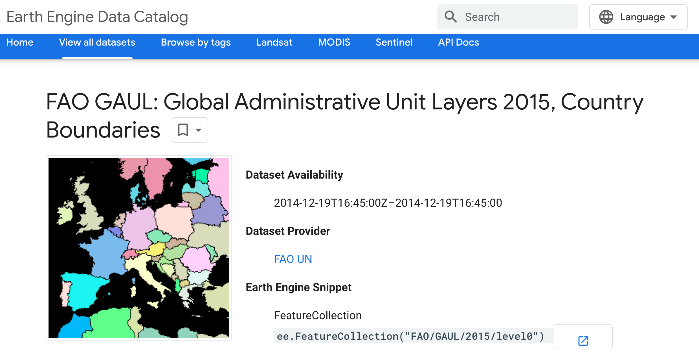
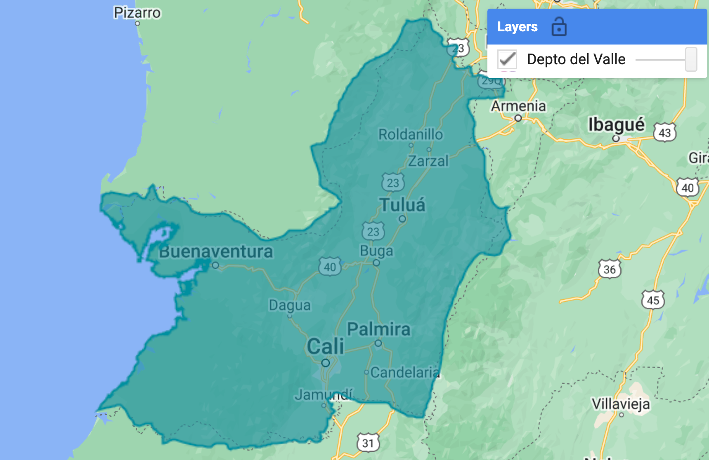
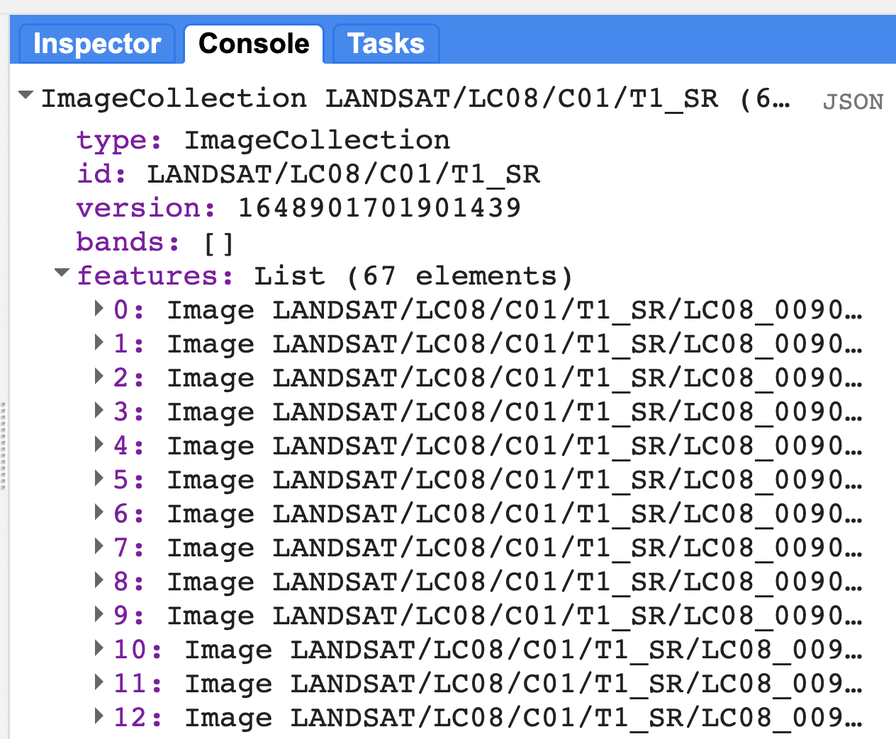
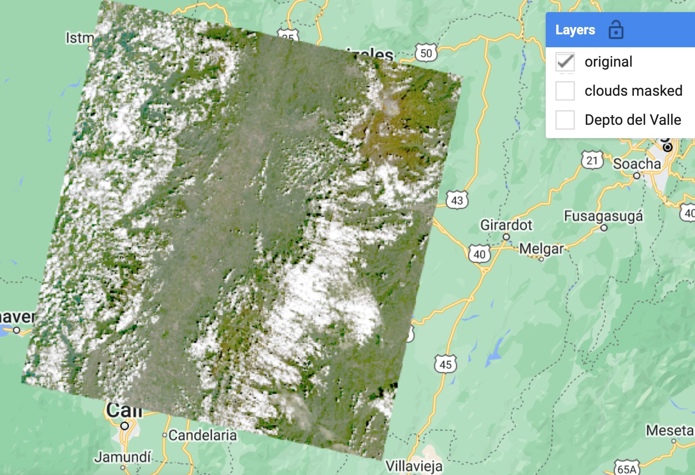
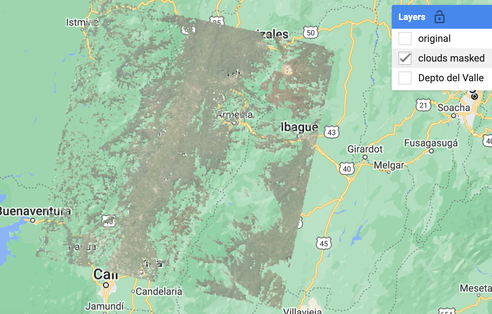
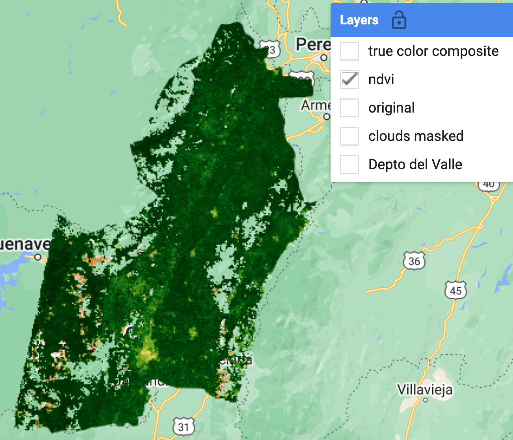
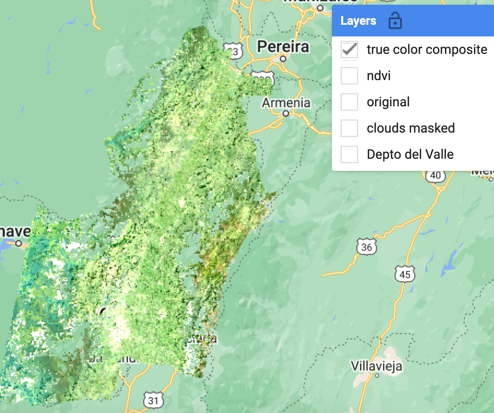
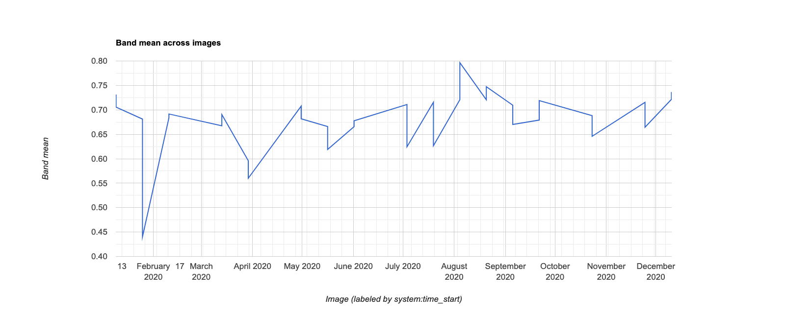

### IALS - 06.10.23

# Descripción general: Catálogo de imágenes satelitales a escala regional

La mayoría de los productos satelitales se dividen en bloques para su distribución. Los datos globales de Landsat se dividen en escenas de ~180 km2, con identificadores únicos de path/row. *<a href="https://www.sciencedirect.com/science/article/abs/pii/S0034425715302194" target="_blank">Wulder et al. (2016)</a>* sugieren  que cada escena es obtenida cada 16 días por los satélites Landsat (aproximadamente 45 veces al año). Los bordes de cada escena se superponen, proporcionando una mayor frecuencia temporal en estas áreas. Sin embargo, los cielos nublados durante el paso de los satélites y otras anomalías de adquisición hacen que ciertas escenas o píxeles sean inutilizables.

*USGS Landsat archive holdings as of January 1, 2015 (Wulder et al. (2016)).*

*Forest loss in Sumatra's Riau province, Indonesia, 2000-2012. Credit: Hansen, Potapov, Moore, Hancher et al., 2013*
-->
 
<!--**455 escenas de Landsat cubren los Estados Unidos:**-->
 

  

 
<!--**455 escenas de Landsat cubren los Estados Unidos:**-->
 

  

Para la mayoría de las aplicaciones a escala regional, se tienen que combinar múltiples imágenes de satélite para cubrir completamente su extensión espacial y completar los datos faltantes causados por las nubes, etc. Google Earth Engine (GEE) es particularmente adecuado para estas tareas.

# Ejercicio: Flujo básico de trabajo GEE

Aquí, aprovecharemos GEE para crear un *composite* que registre el estado de la vegetación para una zona de interés.

### Image Collections

Una pila o serie temporal de imágenes se conoce como `Image Collections`. Cada fuente de datos disponible en GEE tiene su propia Image Collection y su propio ID (por ejemplo, el [Landsat 5 SR collection](https://developers.google.com/earth-engine/datasets/catalog/LANDSAT_LT05_C01_T1_SR), o el producto [CHIRPS Daily: Climate Hazards Group InfraRed Precipitation with Station Data (version 2.0 final)](https://developers.google.com/earth-engine/datasets/catalog/UCSB-CHG_CHIRPS_DAILY). También se puede crear Image Collection a partir de imágenes individuales o fusionar colecciones existentes. Puede encontrar más información sobre las *Image Collection* [aquí en la guía de desarrolladores de GEE](https://developers.google.com/earth-engine/ic_creating).

Para generar imágenes que cubran grandes áreas espaciales y para llenar los vacíos de una imágen debido a las nubes, etc., podemos cargar una `ImageCollection` completa, pero filtrar la colección para devolver sólo los períodos de tiempo o las ubicaciones espaciales que sean de interés. Hay filtros de acceso directo para los que se utilizan comúnmente (imageCollection.filterDate(), imageCollection.filterBounds()...), pero pueden utilizarse la mayoría de los filtros de la sección `ee.Filter()` de la pestaña Docs. Más información sobre [filters on the Developer's Guide](https://developers.google.com/earth-engine/ic_filtering).

### Cargar archivos vectoriales

Trabajaremos en la creación de un *composite* para el departamento del Valle. La forma más fácil de filtrar una ubicación irregular sin tener que identificar el identificador de las imágenes (es decir, sin indicar los valores PATH y ROW de la escena de interés) es usar un polígono vectorial (representado en un *feature* o en un *feature collection*).

Hay tres maneras de obtener datos de vectores en GEE:

  * [Cargar un shapefile](https://developers.google.com/earth-engine/importing) directamente a su carpeta personal *Asset* en el panel superior izquierdo. Puedes crear subcarpetas y establecer permisos para compartir según sea necesario.
  * Utilizar un conjunto de datos de vectores existente en GEE. [Navegue por el catálogo de datos vectoriales aquí](https://developers.google.com/earth-engine/vector_datasets).
  * Dibuje manualmente puntos, líneas y polígonos usando las herramientas de geometría del Code Editor.

Aquí, usaremos un conjunto de datos existente en GEE, el archivo de unidades adminstrativas globales elaborado por la FAO:

 

  


// cargar un polígono de límite de cuenca (una base de datos vectorial pública ya en GEE)

var paises = ee.FeatureCollection('FAO/GAUL/2015/level0');

var colombia = paises.filter(ee.Filter.eq('ADM0_NAME', 'Colombia')); //filtro por nombre de países 
var valle = colombia.filter(ee.Filter.eq('ADM1_NAME', 'Valle del Cauca')); //filtro por nombre de departamentos

print(valle, 'Valle');

Map.centerObject(valle,5);

var estilo = {
  fillColor: 'b5ffb4',
  color: '00909F',
  width: 1.0,
};

Map.addLayer(valle, estilo, 'Depto del Valle');



 

  

### Filtrar una Image Collection

Aquí, estamos seleccionando todas las imágenes en el [Landsat 8 Surface Reflectance collection](https://code.earthengine.google.com/dataset/LANDSAT/LC08/C01/T1_SR) adquirido sobre nuestra zona de interés.

*Consejo: Los ID de las Image collection se encuentran en la barra de herramientas de "Search" en la parte superior del editor de códigos o a través de la búsqueda en el [data archive](https://code.earthengine.google.com/datasets/).*


// cargue todas las imágenes Landsat 8 SR dentro de los límites del polígono para el año 2020
var l8collection = ee.ImageCollection('LANDSAT/LC08/C01/T1_SR')
          .filterBounds(valle)
          .filterDate('2020-01-01', '2020-12-31');
print(l8collection);


Al imprimir nuestra colección filtrada en la consola podemos conocer cuántas imágenes hay en nuestro filtro (67) así como los nombres de las bandas y las propiedades de las imágenes de nuestra colección:
 

  

### Aplicar funciones

Como puede ver al navegar por la pestaña `Docs` en el panel superior izquierdo del Code Editor, hay funciones GEE específicas para los tipos de datos `Image` y `ImageCollection`. Hay muchas funciones, incluyendo operadores matemáticos y booleanos, convoluciones y estadísticas focales, y transformaciones espectrales y análisis de textura espacial. Navegue por la lista, o lea sobre las operaciones generales disponibles en el [GEE Developer's Guide "Image Overview"" section](https://developers.google.com/earth-engine/image_overview).

A menudo, queremos usar una función sobre cada imagen de una Image Collection. Para ello, necesitamos esencialmente "iterar" a través de cada imagen de la colección de imágenes. En GEE, esas "iteraciones" se realizan con la función *.map()*.

**Evitar las iteraciones tradicionales a toda costa.** Usar una iteración *for* lleva la operación al navegador (mala práctica). Al usar *imageCollection.map()*  la operación es enviada a los servidores de Google para una ejecución distribuida (buena práctica).

Se puede encontrar más información sobre la aplicación de funciones a las Image collection [here in the Developer's Guide](https://developers.google.com/earth-engine/ic_mapping).

El concepto *.map()* se aplica también a las `featureCollections` - para aplicar una función a cada elemento de una colección de vectores. Esa función es aplicada usando *featureCollection.map()*. Ver ["Mapping over a Feature Collection"](https://developers.google.com/earth-engine/feature_collection_mapping) en la Guía del Desarrollador.

### Enmascarar nubes

Las imágenes de reflectancia de superficie Landsat Collection 2 incluyen una banda de evaluación de la calidad ("QA_PIXEL") que se deriva del algoritmo CFMask. Identifica nubes, sombras de nubes y nieve/hielo. Es un sistema de enmascaramiento muy bueno, puede leer más sobre él en la sección 6.2 de la [Guía del Producto Científico de Nivel 2 (L2SP) de Landsat 8 Collection 2 (C2)](https://d9-wret.s3.us-west-2.amazonaws.com/assets/palladium/production/s3fs-public/atoms/files/LSDS-1619_Landsat8-C2-L2-ScienceProductGuide-v2.pdf). 

Definimos explícitamente una nueva función llamada "prepSrL8" y la aplicamos a cada imagen de la imageCollection utilizando `imageCollection.map()`. Las funciones necesitan explícitamente que se indique **return** para obtener la salida final.


// Los productos de reflectancia superficial vienen con una banda 'QA_PIXEL'.
// que se basa en cfmask. 

// // A function that scales and masks Landsat 8 (C2) surface reflectance images.
function prepSrL8(image) {
  // Develop masks for unwanted pixels (fill, cloud, cloud shadow).
  var qaMask = image.select('QA_PIXEL').bitwiseAnd(parseInt('11111', 2)).eq(0);
  var saturationMask = image.select('QA_RADSAT').eq(0);

  // Apply the scaling factors to the appropriate bands.
  var getFactorImg = function(factorNames) {
    var factorList = image.toDictionary().select(factorNames).values();
    return ee.Image.constant(factorList);
  };
  var scaleImg = getFactorImg([
    'REFLECTANCE_MULT_BAND_.|TEMPERATURE_MULT_BAND_ST_B10']);
  var offsetImg = getFactorImg([
    'REFLECTANCE_ADD_BAND_.|TEMPERATURE_ADD_BAND_ST_B10']);
  var scaled = image.select('SR_B.|ST_B10').multiply(scaleImg).add(offsetImg);

  // Replace original bands with scaled bands and apply masks.
  return image.addBands(scaled, null, true)
    .updateMask(qaMask).updateMask(saturationMask);
}

// usar "map" para aplicar la función a cada imagen de la colección
var landsat8Masked = landsat8Collection.map(prepSrL8);

print(landsat8Masked.limit(5));

// visualizar la primera imagen de la colección, antes y después de la máscara

var visu_antes = {bands: ["SR_B4","SR_B3","SR_B2"], gamma: 5,
           max: 38000,
           min: 8000};
           
           
var visu_despues = {bands: ['SR_B4','SR_B3','SR_B2'], gamma: 2,
                    min: 0.01, max: 0.25};

Map.addLayer(ee.Image(landsat8Masked.first()), visu_despues, 'clouds masked', false);
Map.addLayer(ee.Image(landsat8Collection.first()), visu_antes, 'original', false);


 

  

 

  

### Calcular el índice NDVI como una nueva banda

Del mismo modo, si queremos calcular el NDVI en cada imagen y añadirlo como una nueva banda, tenemos que crear una función y mapearla sobre la colección. Aquí, usamos la función `normalizedDifference()`. [Mathematical Operations page in the GEE Developer's Guide](https://developers.google.com/earth-engine/image_math) proporciona más información sobre cálculos raster simples y complejos.


// crear una función para añadir el NDVI usando la banda NIR (B5) y roja (B4)
var getNDVI = function(img){
  return img.addBands(img.normalizedDifference(['SR_B5','SR_B4']).rename('NDVI'));
};

// ejemplo extra: una función equivalente usando álgebra de mapas
var getNDVI2 = function(img){
  return img.addBands(img.select('SR_B5').subtract(img.select('SR_B4'))
            .divide(img.select('SR_B5').add(img.select('SR_B3'))));
};

// aplicar la función sobre la image collection
var l8ndvi = l8masked.map(getNDVI);

// imprime una imagen para ver que la banda está ahora allí
print(ee.Image(l8ndvi.first()));


### Crear un Composite "Greenest Pixel"

Ahora necesitamos reunir la Image Collection para crear una imagen continua a través de la cuenca. Hay varias opciones de mosaico/composición disponibles, desde simples composiciones de valor máximo (`imageCollection.max()`) y mosaicos sencillos con la imagen más reciente (`imageCollection.mosaic()`).   [Compositing and Mosaicking page on the Developer's Guide](https://developers.google.com/earth-engine/ic_composite_mosaic) proporciona más ejemplos.

Aquí, usaremos la función `imageCollection.qualityMosaic()`. Al priorizar la imagen a utilizar en base a una banda específica, este método asegura que los valores de todas las bandas se tomen de la misma imagen. A cada píxel se le asignan los valores de la imagen con el valor más alto de la banda deseada.

Usaremos esto para hacer un "greenest pixel composite" para nuestra cuenca basado en la banda del NDVI que acabamos de calcular. La imagen compuesta final retendrá todas las bandas en la entrada (a menos que especifiquemos lo contrario). Cada píxel en la imagen compuesta podría potencialmente provenir de imágenes adquiridas en fechas diferentes, pero todas las bandas dentro de cada píxel son de la misma imagen. En general, esto proporciona la mejor instantánea disponible del paisaje en el pico de la temporada de crecimiento, independientemente del momento fenológico dentro del año.


// para cada pixel, seleccione el "mejor" conjunto de bandas de las imágenes disponibles
// basado en el máximo NDVI/greenness
var composite = l8ndvi.qualityMosaic('NDVI').clip(valle);
print(composite);

// Visualizar el NDVI
var ndviPalette = ['FFFFFF', 'CE7E45', 'DF923D', 'F1B555', 'FCD163', '99B718',
               '74A901', '66A000', '529400', '3E8601', '207401', '056201',
               '004C00', '023B01', '012E01', '011D01', '011301'];
Map.addLayer(composite.select('NDVI'),
            {min:0, max: 1, palette: ndviPalette}, 'ndvi');


El máximo anual de NDVI a través de este valle destaca las zonas urbanas y con presencia de suelo desnudo con valores bajos y en las zonas de vegetación densa, los más verdes :

 

  

También podemos usar esta imagen compuesta para visualizar una composición de color verdadero usando las bandas RGB:


// Visualizar el compuesto en color verdadero 
Map.addLayer(composite, {bands: ['SR_B4', 'SR_B3', 'SR_B2'], gamma:1.5,  min: 0, max: 0.30}, 'true color composite', false);


 

  

### Visualizar los resultados en un gráfico
Para ilustrar brevemente la capacidad de GEE de generar gráficos, cargamos el producto de datos MODIS NDVI para trazar la serie temporal anual de NDVI medio de nuestra cuenca. La generación de gráficos también está cubierto en el [módulo 04 Reductores espaciales y temporales](https://hasencios.github.io/GEE_BASICO_SENAMHI/04-reducers/).



// Gráfico de series temporales anuales del NDVI medio en el Valle
// de nuestro compuesto calculado de Landsat 8
var chart = ui.Chart.image.series({
    imageCollection: l8ndvi.select('NDVI'),
    region: valle,
    reducer: ee.Reducer.mean(),
    scale: 250,
})
print(chart)  //** Puede exportar la figura o los datos en la ventana

// También se puede comparar con el producto MODIS de 16 días

// añadir series temporales de satélites: producto MODIS NDVI 250m de 16 días
var modis = ee.ImageCollection('MODIS/006/MOD13Q1')
          .filterBounds(valle)
          .filterDate('2020-01-01', '2020-12-31')
          .select('NDVI');

// Gráfico de series temporales anuales del NDVI medio en el Valle
// del producto suavizado MODIS 16 días
var chart = ui.Chart.image.series({
    imageCollection: modis,
    region: valle,
    reducer: ee.Reducer.mean(),
    scale: 250
})
print(chart)



Tenga en cuenta que puede exportar los datos subyacentes del gráfico mediante el icono de la flecha que aparece...
 

  

### Exportar los resultados como una Table
La manera más eficiente de obtener datos de GEE es en una tabla. Esta forma tiene el beneficio de estar codificada y por lo tanto ser totalmente reproducible. Exportar tablas también requiere mucha menos potencia de cálculo que exportar una imagen completa. Cuando realices un análisis, piensa bien en cómo puedes dejar el raster en la nube y extraer los datos que necesitas como una matriz.



// Use los botones de la tabla emergente para exportar el .csv, o puede hacer un guión
// la exportación como sigue utilizando un reductor:

// obtener el valor medio de la región de cada imagen
var ts = modis.map(function(image){
  var date = image.get('system:time_start');
  var mean = image.reduceRegion({
    reducer: ee.Reducer.mean(),
    geometry: valle,
    scale: 250
  });
  // y devuelve una característica con geometría 'null' con propiedades (dictionary)  
  return ee.Feature(null, {'mean': mean.get('NDVI'),
                            'date': date})
});

// Exportar una tabla de fecha .csv, media NDVI para la cuenca
Export.table.toDrive({
  collection: ts,
  description: 'VALLE_2020_MODIS_NDVI_stats',
  folder: 'GEE_RIO',
  fileFormat: 'CSV'
});

// Y PULSE "RUN" EN LA PESTAÑA DE TAREAS EN EL PANEL SUPERIOR DERECHO



Para ejecutar las tareas de exportar, debes ir a la pestaña 'Tasks' en el panel superior derecho y presionar 'Run'.

 

  

### Exportar Images

Los usuarios pueden exportar los resultados de sus manipulaciones de imágenes a su carpeta de activos de GEE para su uso posterior dentro de la plataforma o a sus cuentas personales de Google Drive o de Google Cloud Storage. Aquí, exportaremos una imagen de una sola banda de NDVI máximo anual para nuestra cuenca. Se proporcionaran ejemplos para exportar a Google Drive. Se puede encontrar más información sobre exportar
 [here in the Developers Guide](https://developers.google.com/earth-engine/exporting).

En la API de JavaScript, lo que se quiera exportar se envía a la pestaña 'Tasks' en el panel superior derecho. Para evitar que los usuarios inunden el sistema inadvertidamente con tareas gratuitas y accidentales, es necesario ejecutar explícitamente la tarea individualmente desde la pestaña 'Task'. Puede cambiar los nombres de los archivos y otros parámetros aquí, si es necesario, o codificarlos en su script.

Al exportar a Google Drive, GEE encontrará la carpeta con el nombre especificado y no necesita la ruta de archivo completa. Si esta carpeta aún no existe, la creará en tu unidad.



// La exportación es innecesaria, pero aquí están los ejemplos de código para salvar un
// imagen compuesta si se desea.  

// seleccione sólo la banda de ndvi
var ndvi = composite.select('NDVI');

// Ejemplo de exportación a Google Drive
// (nota: hay que pulsar 'Run' en la pestaña de tareas en el panel superior derecho)
Export.image.toDrive({
  image: ndvi,
  description: 'VALLE_2020_L8_NDVI_image',
  scale: 30,
  region: valle.geometry().bounds(), // .geometry().bounds() needed for multipolygon
  crs: 'EPSG:9377',
  folder: 'GEE_RIO',
  maxPixels: 2000000000
});

// Ejemplo de exportación de una carpeta de assets
// (nota: hay que pulsar 'Run' en la pestaña de tareas en el panel superior derecho)
Export.image.toAsset({
  image: ndvi,
  description: 'VALLE_2020_L8_NDVI_image',
  assetId: 'users/yourname/VALLE_2020_L8_NDVI_image',
  scale: 30,
  region: valle.geometry().bounds(),
  pyramidingPolicy: {'.default':'mean'}, // use {'.default':'sample'} for discrete data
  maxPixels: 2000000000
});



Se puede acceder a una versión estática del script aquí: [https://code.earthengine.google.com/ffa242458bb93993fbfb088a4f7b7f62](https://code.earthengine.google.com/ffa242458bb93993fbfb088a4f7b7f62)