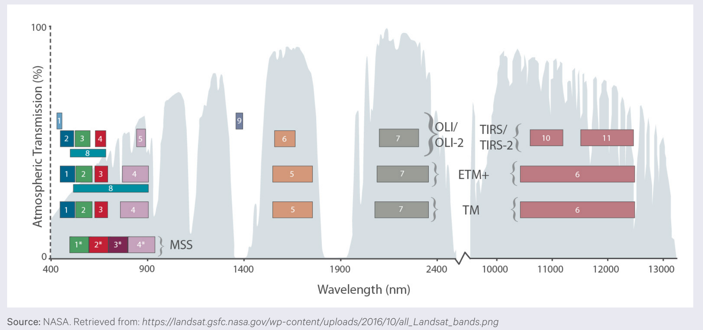
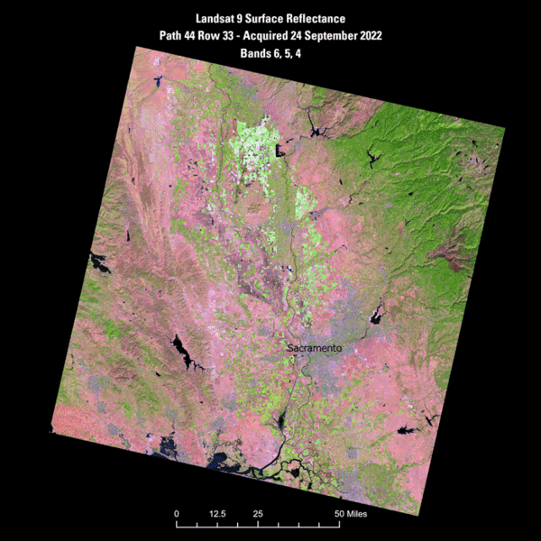
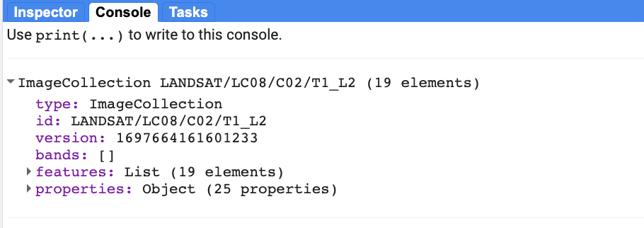
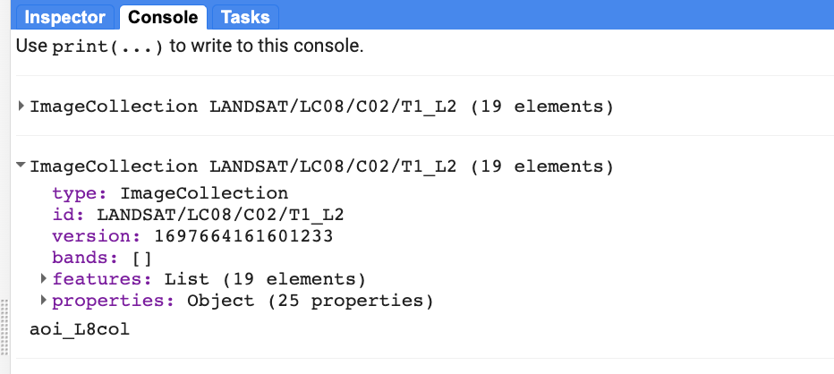
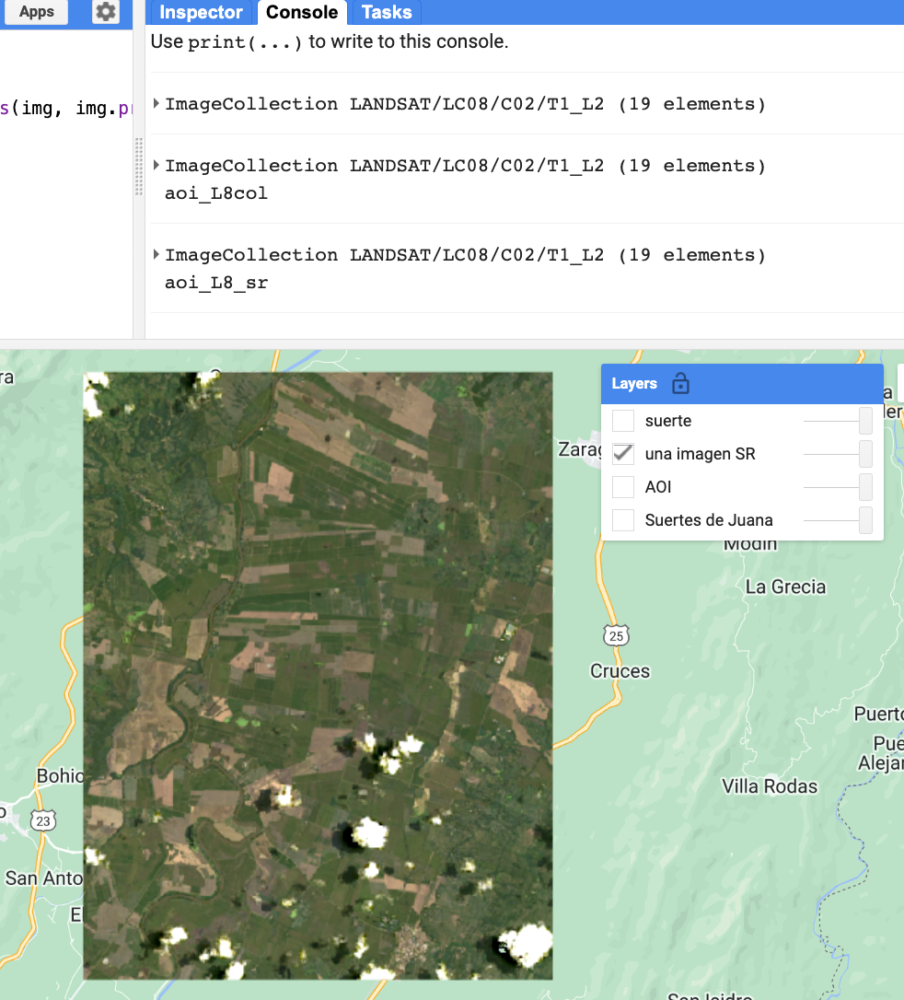
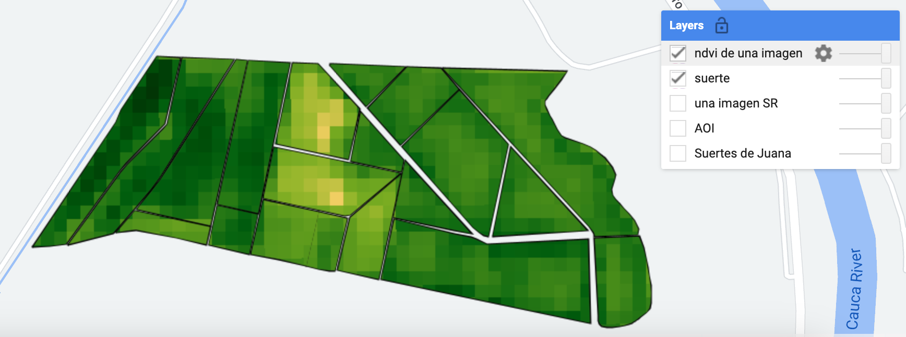
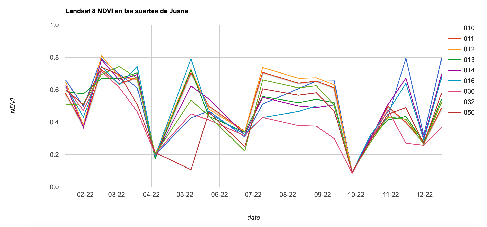
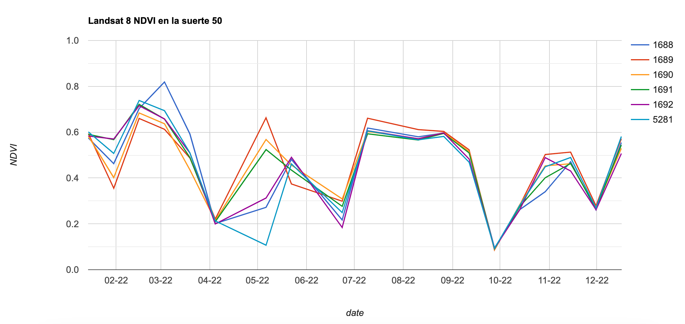

## IALS - 18.10.2023

# Descripción general: Bandas espectrales de las imágenes  Landsat

Las imágenes Landsat tienen bandas espectrales que se muestran en la siguiente gráfica:

*USGS Landsat archive holdings as of January 1, 2015 (Wulder et al. (2016)).*

Note que en los sensores OLI (Landsat 8) y OLI 2 (Landsat 9) la banda del infrarrojo cercano es la Banda 5 y que la banda del rojo es la Banda 4.

# Indices espectrales a partir de imagenes Landsat

Una imagen Landsat permite obtener una gran variedad de indices espectrales, por ejmplo:

- Normalized Difference Vegetation Index (NDVI)

- Enhanced Vegetation Index (EVI)

- Soil Adjusted Vegetation Index (SAVI)

- Modified Soil Adjusted Vegetation Index (MSAVI)

- Normalized Difference Moisture Index (NDMI)

- Normalized Burn Ratio (NBR)

- Normalized Burn Ratio 2 (NBR2) 

Para información sobre cada índice consulte [este enlace](https://www.usgs.gov/landsat-missions/landsat-surface-reflectance-derived-spectral-indices).

*USGS Landsat spectral indices*
https://www.usgs.gov/landsat-missions/landsat-surface-reflectance-derived-spectral-indices

# Ejercicio: Obtención de series de tiempo del indice de vegetacion

Aquí, usaremos GEE para calcular el NDVI de todas las imágenes Landsat-8 de 2022 que cubran una zona de interés.

### Obtención y filtrado de la colección 

El siguiente codigo permite filtar la colección usando el año de interés y los límites de la zona de estudio:


// Cargar los límites vectoriales y la colección Landsat
// ----------------------------------------------------------------------------------------

// cargar una tabla con la zona de estudio
// suerte es un objeto importado usando el shapefile de suertes de La Juana
var suerte = ee.FeatureCollection("users/ivanlizarazo/RIO/ste_La_Juana");
// 

// establecer la vista del mapa y el zoom, y añadir la zona de interés
//Map.setCenter(-76.6725, 3.7065, 10);
Map.centerObject(suerte,16);
Map.addLayer(suerte, {}, 'Suertes de Juana', false);
//Map.addLayer(AOI, {}, 'AOI', false);

// cargue todas las imágenes Landsat 8 SR dentro de los límites del polígono para el año 2022
var l8Col = ee.ImageCollection('LANDSAT/LC08/C02/T1_L2')
          .filterBounds(suerte)
          .filterDate('2022-01-01', '2022-12-31');

print(l8Col);


 

  

### Recorte

Ahora, vamos a recortar las imágenes:


// 
// -----------------------------------------------------------------
// Recortar las imagenes para que cubran la zona de interes
// -----------------------------------------------------------------

// funcion para recortar una imagen
function recortar(img) {
  return img.clip(suerte);
}

// iteracion sobre toda la coleccion
var aoi_L8col = l8Col.map(recortar);

// imprimir el resultado
print(aoi_L8col, 'aoi_L8col');


 

  

### Rescalamiento

Enseguida, rescalamos las imagenes usando los parametros indicados en el catalogo de datos de GEE:


// -----------------------------------------------------------------
// Rescalar las imagenes para obtener reflectancia de superficie
// -----------------------------------------------------------------

var escala = 0.0000275;
var inter = -0.2;
// funcion para rescalar una imagen
function rescalar(img) {
  return img.select('SR_B.|SR_B7').multiply(escala).add(inter).copyProperties(img, img.propertyNames());
}

// iteracion sobre toda la coleccion
var aoi_L8_sr = aoi_L8col.map(rescalar);

// imprimir el resultado
print(aoi_L8_sr, 'aoi_L8_sr');

// visualizar el resultado
var param= {bands: ["SR_B5","SR_B6","SR_B3"],
             gamma: 1.5,
             max: 0.25,
             min: 0.10,
             opacity: 1};

// seleccionar la imagen con menos nubes             
var una_imagen = aoi_L8_sr.sort('CLOUD_COVER').first();

// visualizar la imagen
Map.addLayer(una_imagen, param, 'una imagen SR');
Map.addLayer(suerte, param, 'suerte');


 

  

### Cálculo del indice de vegetacion NDVI


/ -----------------------------------------------------------------
// Calcular el NDVI como una nueva banda
// -----------------------------------------------------------------

// crear una función para estimar el NDVI usando la banda NIR (B5) y la roja (B4)
var getNDVI = function(image){
  return image.addBands(image.normalizedDifference(['SR_B5','SR_B4']).rename('NDVI'));
};

//
// Una funcion para calcular NDVI y conservar las propiedades de las  imagenes 
var calcNDVI = function(image){
  var ndvi = image.normalizedDifference(['SR_B5', 'SR_B4']).rename('NDVI');
  return(ndvi.copyProperties(image, image.propertyNames()));
};

// ejemplo extra: una función equivalente usando el álgebra de mapas
var getNDVI2 = function(image){
  return image.addBands(image.select('SR_B5').subtract(image.select('SR_B4'))
            .divide(image.select('SR_B5').add(image.select('SR_B3'))).rename('NDVI'));
};

// map sobre la image collection
//var l8Ndvi = aoi_L8_sr.map(getNDVI); // this code doesn't return image properties
var l8Ndvi = aoi_L8_sr.map(calcNDVI);

print(l8Ndvi, 'l8Ndvi');

// obtener el NDVI de la imagen con menos nubes
var un_Ndvi = l8Ndvi.sort("CLOUD_COVER").first();

// imprime una imagen para ver que la banda está ahora allí
print(un_Ndvi, 'un_Ndvi');

// observe que la imagen contiene las siete bandas originales
// y adicionalmente la nueva banda NDVI

// ---------------------------------------------------------------------
// Visualizar un NDVI
// ---------------------------------------------------------------------

// Defina la paleta de colores para el NDVI
var ndviPalette = ['FFFFFF', 'CE7E45', 'DF923D', 'F1B555', 'FCD163', '99B718',
              '74A901', '66A000', '529400', '3E8601', '207401', '056201',
              '004C00', '023B01', '012E01', '011D01', '011301'];

// Visualizar la banda NDVI 
Map.addLayer(un_Ndvi.select('NDVI'), 
            {min:0, max: 1, palette: ndviPalette}, 'ndvi de una imagen');

// Obtener una colleccion que tenga unicamente la banda NDVI 
var NDVIcol = l8Ndvi.select('NDVI');
print(NDVIcol, 'NDVIcol');


 

  

### Obtencion de series temporales de  NDVI para todas las suertes


//
// Obtener los valores promedio de NDVI 2022 para todas las suertes

 // Plot NDVI ---------------------------------------------------------------------------------------------
var NDVIChart = ui.Chart.image.seriesByRegion({
  imageCollection: NDVIcol,
  regions: suerte,
  reducer: ee.Reducer.mean(), //type of reduction. See ee.Reducers for other kinds of reductions
  scale: 30, //spatial scale of Landsat bands
  seriesProperty: 'suerte',  //property of suertes to display in map
  xProperty: 'system:time_start'
})
  .setOptions({
    title: 'Landsat 8 NDVI para las suertes de Juana',
    vAxis: {title: 'NDVI', maxValue: 1, minValue: 0},
    hAxis: {title: 'date', format: 'MM-yy', gridlines: {count: 12}},
  });

print(NDVIChart);


En la consola se visualizan las series de tiempo de cada suerte en el periodo de tiempo seleccionado.

Las series de tiempo se pueden visualizar con mas detalle si se hace clic en el icono de la esquina superior derecha de la consola. 
Desde la ventana emergente pueden exportar las series de tiempo en formato CSV para realizar post-proceso en otro programa.

 

  

### Obtencion de series temporales de  NDVI para una suerte


//
var suerte50 = suerte.filter(ee.Filter.eq('suerte', '050'));

// Obtener los valores promedio de NDVI 2022 para la suerte de interes

 // Plot NDVI ---------------------------------------------------------------------------------------------
var NDVIChart = ui.Chart.image.seriesByRegion({
  imageCollection: NDVIcol,
  regions: suerte50,
  reducer: ee.Reducer.mean(), //type of reduction. See ee.Reducers for other kinds of reductions
  scale: 30, //spatial scale of Landsat bands
  seriesProperty: 'ID',  //property of suertes to display in map
  xProperty: 'system:time_start'
})
  .setOptions({
    title: 'Landsat 8 NDVI en la suerte 50',
    vAxis: {title: 'NDVI', maxValue: 1, minValue: 0},
    hAxis: {title: 'date', format: 'MM-yy', gridlines: {count: 12}},
  });

print(NDVIChart);


 

  

Se puede acceder a una versión estática del script aquí: [https://code.earthengine.google.com/f69dc39a3fbeb030c4973869f6ede8d3](https://code.earthengine.google.com/f69dc39a3fbeb030c4973869f6ede8d3)