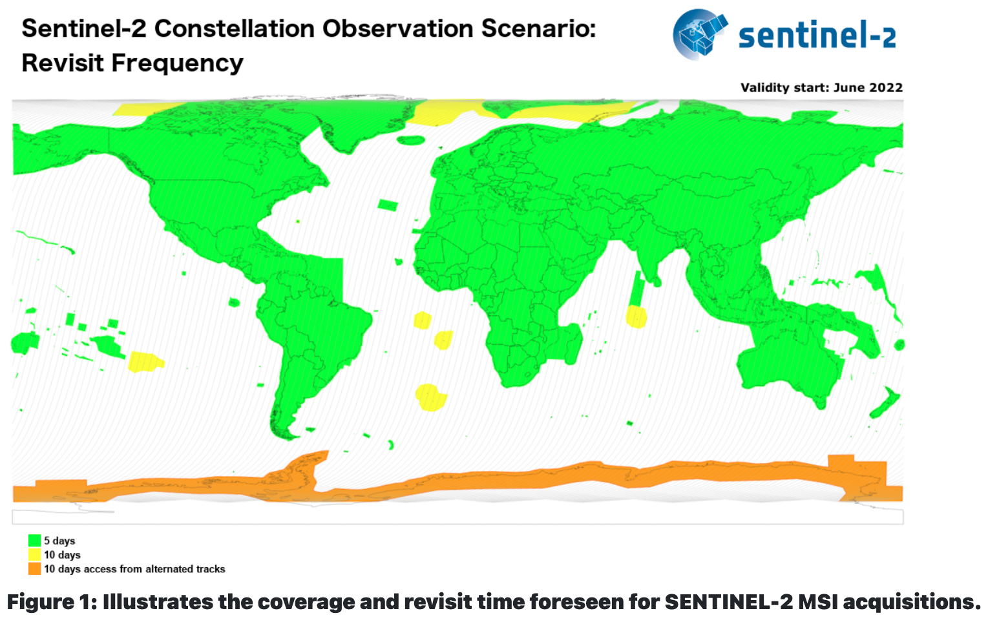
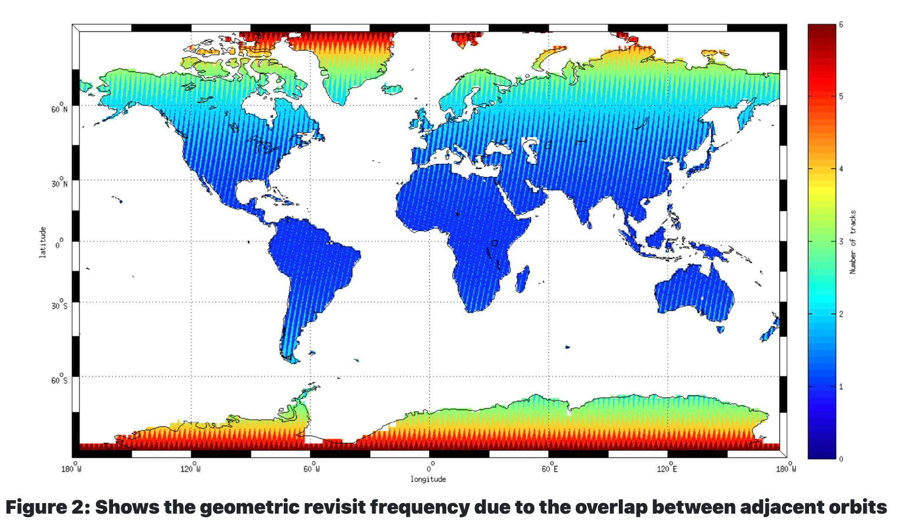
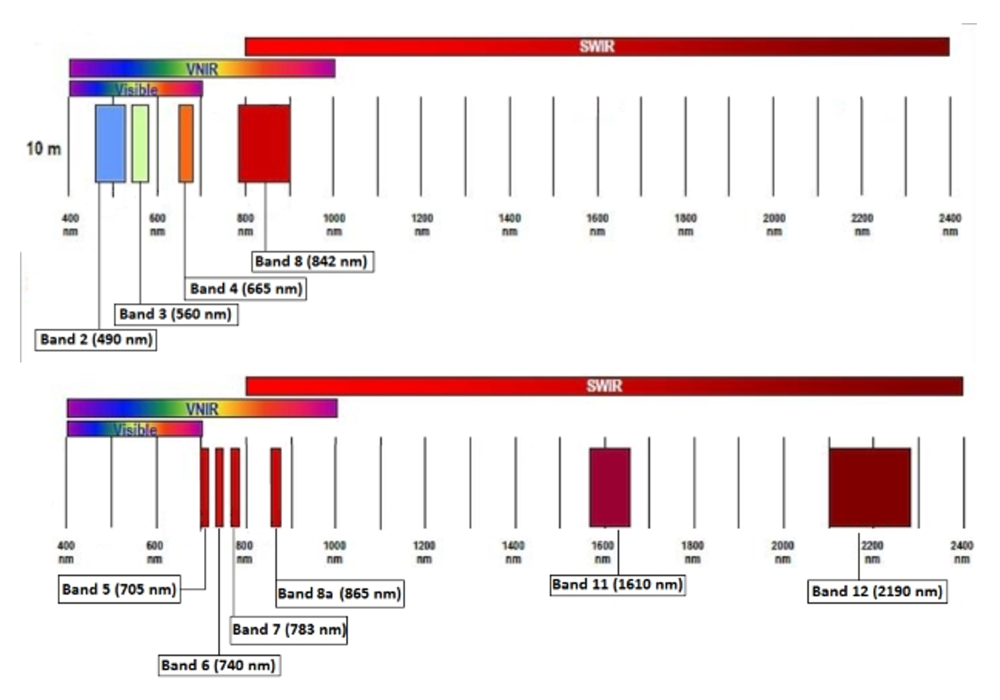
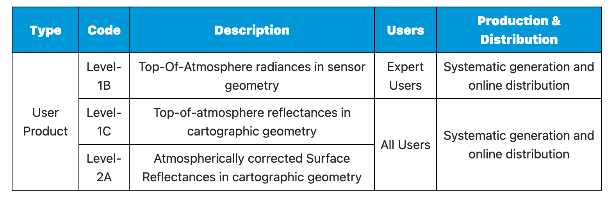
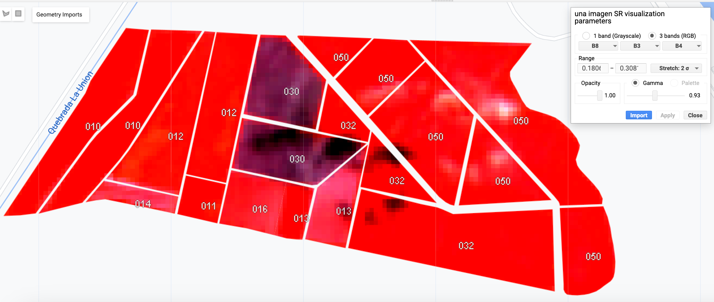
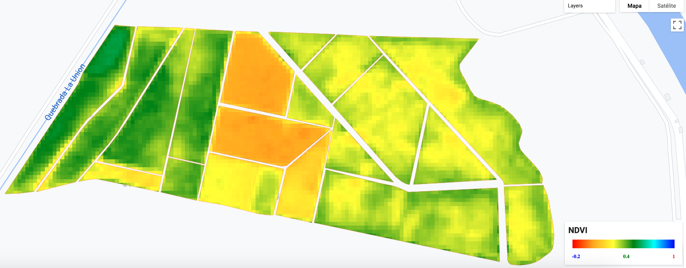
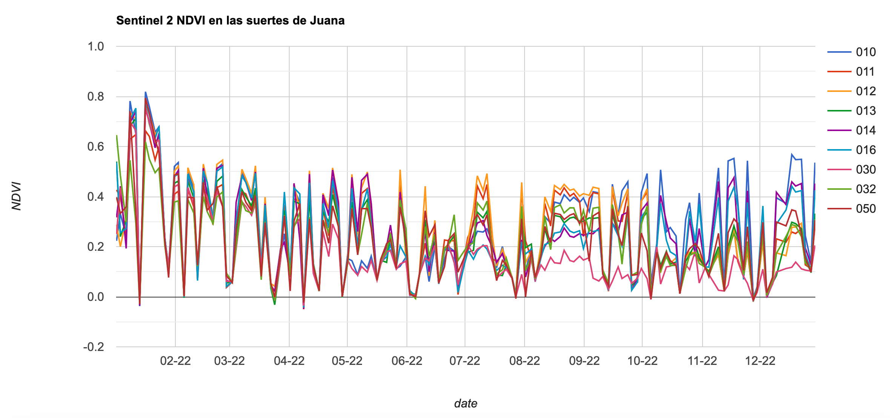
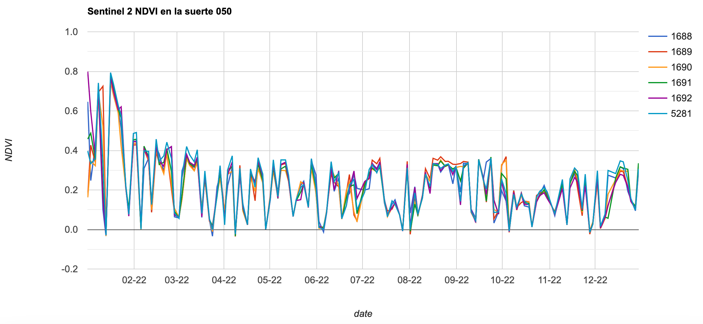

## IALS - 18.10.2023

# Descripción general: Imágenes  Sentinel-2

La misión Sentinel- 2 de la agencia espacial europea tiene un cubrimiento global y un tiempo de revisita bastante frecuente.

*Sentinel 2 coverage*

*Sentinel 2 revisit time*

Las imágenes Sentinel-2 tienen bandas con mejor resolución espacial que Landsat:

*Sentinel 2 spatial resolution*

Al igual que otras imágenes satelitales, existen diversos niveles de procesamiento de las imágenes Sentinel-2:

*Sentinel 2 processing levels*

Las imágenes Sentinel-2 tienen algunas bandas espectrales similares a Landsat tal como se muestra en la siguiente gráfica:

*USGS Landsat and Sentinel 2 have similar bands.*

Una de las diferencias es que el sensor multiespectral de Sentinel-2 adquiere tres bandas en el borde del rojo, con centro en 705, 740 y 783 nm, que son útiles para la caracterización de la vegetación.

Una composición RGB SWIR-1 (B11), infrarrojo cercano (B8), y azul (B2) de Sentinel 2 se muestra en la siguiente figura:

 

  

Esta composición se puede usar para monitorear la salud de los cultivos. La vegetación vigorosa se muestra en color verde oscuro.

# Indices espectrales a partir de imagenes Sentinel-2

Una imagen Sentinel-2 permite obtener una gran variedad de indices espectrales.

En [este enlace](https://custom-scripts.sentinel-hub.com/custom-scripts/sentinel-2/indexdb/) hay una lista extensa de indices que se pueden obtener con estas imágenes.

*Sentinel-2 NDVI*
https://www.usgs.gov/landsat-missions/landsat-surface-reflectance-derived-spectral-indices

# Ejercicio: Obtención de series de tiempo de un indice de vegetacion

En este ejercicio vamos calcular el NDVI de todas las imágenes Sentinel-2 de 2022 que cubren la zona de interés.

El proceso es similar al utilizado para las imagenes Landsat-8. Aunque la banda Red de Sentinel-2 es la Banda 4, la banda NIR es la Banda 8. Eso determina que la formula para el cálculo del indice NDVI es diferente.

Lo primero que vamos a hacer es obtener una colección de imágenes para el periodo de interés y obtener reflectancia de superficie:


// -----------------------------------------------------------------
// Obtener  las imagenes Sentinel-2 
// -----------------------------------------------------------------
//Paso 1: Despliegue la tabla con la zona de estudio
// 
var tabla = ee.FeatureCollection("users/ivanlizarazo/RIO/ste_La_Juana");

Map.centerObject(tabla,17);
Map.addLayer(tabla, {}, 'Juana');

//Paso 2: Acceda a la coleccion  Sentinel-2 Level-2A  
// Filtre las imagenes de 2022 y seleccione las bandas relevantes  
// Eventualmente, filtre por nubosidad
//
var s2a = ee.ImageCollection('COPERNICUS/S2_SR')
                  .filterBounds(tabla)
                  .filterDate('2022-01-01', '2022-12-31')
                  .select('B1','B2','B3','B4','B5','B6','B7','B8','B8A','B9','B11','B12');
                  //.filter(ee.Filter.lt('CLOUDY_PIXEL_PERCENTAGE', 50));

//Print your ImageCollection to your console tab to inspect it
print(s2a, 'S2 Image Collection Juana');

// funcion para recortar una imagen
function recortar(img) {
  return img.clip(tabla);
}

// iteracion sobre toda la coleccion
var aoi_S2c = s2a.map(recortar);

// imprimir el resultado
print(aoi_S2c, 'aoi_L8col');

// plotear una imagen
var una_imagen = aoi_S2c.sort('CLOUDY_PIXEL_PERCENTAGE').first();

var param1 = {bands: ["B4","B3","B2"], gamma: 1, max: 2400, min: 1300, opacity: 1}

Map.addLayer(una_imagen,param1, "una_imagen");

// Note que hay 139 imagenes en toda la coleccion

// -----------------------------------------------------------------
// Rescalar las imagenes para obtener reflectancia de superficie
// -----------------------------------------------------------------
// Al buscar en el catalogo de imagenes la coleccion "COPERNICUS/S2_SR
// se encuentran los parametros de *scale* and *offset*
var escala = 0.0001;

// funcion para rescalar una imagen
function rescalar(img) {
  return img.select('B.|B7').multiply(escala).copyProperties(img, img.propertyNames());
}

var aoi_S2r = aoi_S2c.map(rescalar);

// imprimir el resultado
print(aoi_S2r, 'aoi_S2r');

// visualizar el resultado
var param= {bands: ["B4","B3","B2"],
             gamma: 1.5,
             max: 0.28,
             min: 0.00,
             opacity: 1};

// seleccionar la imagen con menos nubes             
var una_imagen = aoi_S2r.sort('CLOUDY_PIXEL_PERCENTAGE').first();

// visualizar la imagen
Map.addLayer(una_imagen, param, 'una imagen SR');
Map.addLayer(tabla, param, 'suerte');


La siguiente figura muestra la imagen de reflectancia de superficie con menos nubes:
 

  

Enseguida, vamos a calcular el indice NDVI en toda la colección de imágenes:


// -----------------------------------------------------------------
// Calcular el NDVI como una nueva banda
// -----------------------------------------------------------------

// crear una función para estimar el NDVI usando la banda NIR (B5) y la roja (B4)
//
var calcNDVI = function(image){
  var ndvi = image.normalizedDifference(['B8', 'B4']).rename('NDVI');
  return(ndvi.copyProperties(image, image.propertyNames()));
};

// iterar en toda la colleccion 
var s2Ndvi = aoi_S2r.map(calcNDVI);

print(s2Ndvi, 'l8Ndvi');

// obtener el NDVI de la imagen con menos nubes
var un_Ndvi = s2Ndvi.sort('CLOUDY_PIXEL_PERCENTAGE').first();

// imprime una imagen para ver que la banda está ahora allí
print(un_Ndvi, 'un_Ndvi');

// observe que la imagen contiene las siete bandas originales
// y adicionalmente la nueva banda NDVI

// ---------------------------------------------------------------------
// Visualizar un NDVI
// ---------------------------------------------------------------------
// paleta de colores
var NDVIvis = {min:-0.2, max: 1.0, palette: ["red","orange","yellow","green", "cyan", "blue"]};

// Visualizar la banda NDVI 
Map.addLayer(un_Ndvi.select('NDVI'), NDVIvis, 'otra visualizacion de ndvi');


La siguiente figura muestra un indice de vegetacion NDVI:
 

  

Enseguida vamos a obtener la serie temporal de NDVI para cada una de las suertes de Juana:


// Obtener una coleccion que tenga unicamente la banda NDVI 
var NDVIcol = s2Ndvi.select('NDVI');
print(NDVIcol, 'NDVIcol');

//
// Obtener los valores de NDVI 2022 para las suertes de Juana

 // Plot NDVI ---------------------------------------------------------------------------------------------
var NDVIChart = ui.Chart.image.seriesByRegion({
  imageCollection: NDVIcol,
  regions: tabla,
  reducer: ee.Reducer.mean(), //type of reduction. 
  scale: 10, //spatial scale of Sentinel-2 bands
  seriesProperty: 'suerte',  //property of suertes to display in map
  xProperty: 'system:time_start'
})
  .setOptions({
    title: 'Sentinel 2 NDVI en las suertes de Juana',
    vAxis: {title: 'NDVI', maxValue: 1, minValue: 0},
    hAxis: {title: 'date', format: 'MM-yy', gridlines: {count: 12}},
  });

print(NDVIChart);


El resultado es la serie de tiempo de NDVI para suerte:

 

  

Finalmente, vamos a obtener la serie de tiempo NDVI unicamente para la suerte 050:

// Obtener los valores de NDVI 2022 para una suerte
// 
// Filtrar la suerte de interes
var suerte50 = tabla.filter(ee.Filter.eq('suerte', '050'));

// Plot NDVI ---------------------------------------------------------------------------------------------
var NDVIChart2 = ui.Chart.image.seriesByRegion({
  imageCollection: NDVIcol,
  regions: suerte50,
  reducer: ee.Reducer.mean(), //type of reduction. 
  scale: 10, //spatial scale of Sentinel-2 bands
  seriesProperty: 'ID',  //property of suertes to display in map
  xProperty: 'system:time_start'
})
  .setOptions({
    title: 'Sentinel 2 NDVI en la suerte 050',
    vAxis: {title: 'NDVI', maxValue: 1, minValue: 0},
    hAxis: {title: 'date', format: 'MM-yy', gridlines: {count: 12}},
  });

print(NDVIChart2);


El resultado es la serie de tiempo de NDVI para suerte:

 

  

Se puede acceder a una versión estática del script aquí:
[https://code.earthengine.google.com/c14ae03ea7159f27ea8423f5f8e07b48](https://code.earthengine.google.com/c14ae03ea7159f27ea8423f5f8e07b48)

