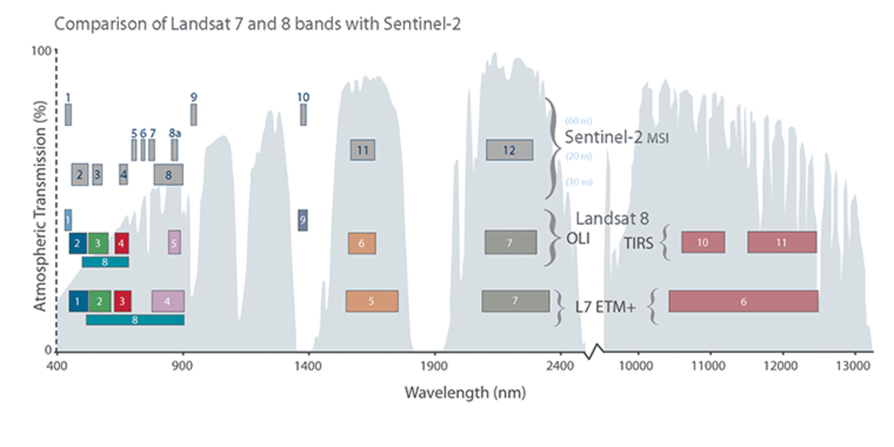
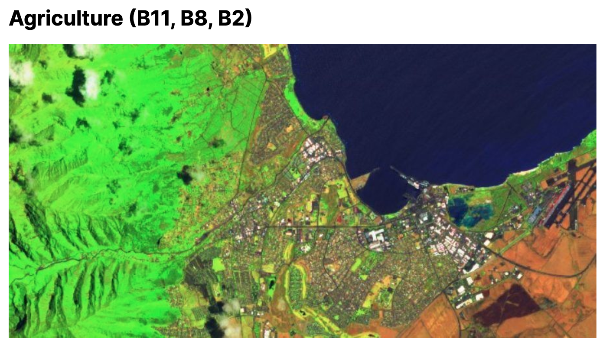
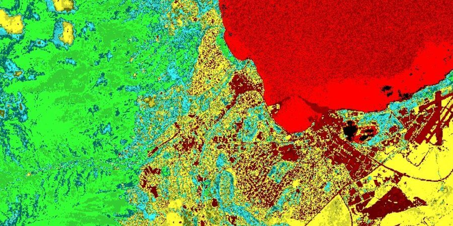
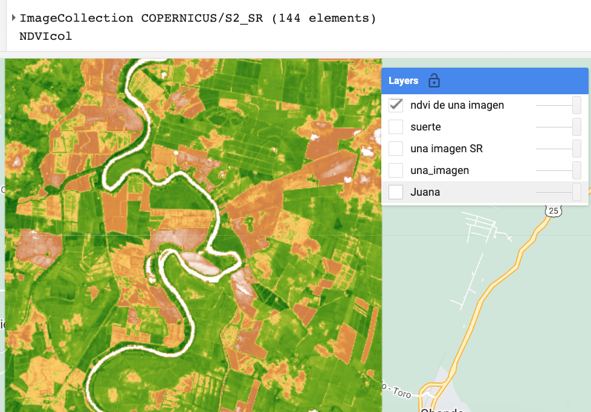
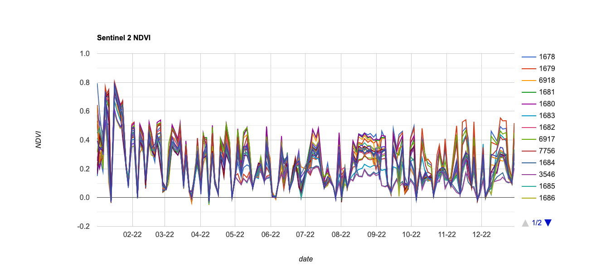

## IALS - 18.10.2023

# Descripción general: Bandas espectrales de las imágenes  Sentinel-2

Las imágenes Sentinel-2 tienen algunas bandas espectrales similares a Landsat tal como se muestra en la siguiente gráfica:

*USGS Landsat and Sentinel 2 have similar bands.*

Una de las diferencias es que el sensor multiespectral de Sentinel-2 adquiere tres bandas en el borde del rojo, con centro en 705, 740 y 783 nm, que son útiles para la caracterización de la vegetación.

Una composición RGB SWIR-1 (B11), infrarrojo cercano (B8), y azul (B2) de Sentinel 2 se muestra en la siguiente figura:

 

  

Esta composición se puede usar para monitorear la salud de los cultivos. La vegetación vigorosa se muestra en color verde oscuro.

# Indices espectrales a partir de imagenes Sentinel-2

Una imagen Sentinel-2 permite obtener una gran variedad de indices espectrales.

En [este enlace](https://custom-scripts.sentinel-hub.com/custom-scripts/sentinel-2/indexdb/) hay una lista extensa de indices que se pueden obtener con estas imágenes.

*Sentinel-2 NDVI*
https://www.usgs.gov/landsat-missions/landsat-surface-reflectance-derived-spectral-indices

# Ejercicio: Obtención de series de tiempo de un indice de vegetacion

En este ejercicio vamos calcular el NDVI de todas las imágenes Sentinel-2 de 2022 que cubran una zona de interés.

El proceso es similar al utilizado para las imagenes Landsat-8. Aunque la banda Red de Sentinel-2 es la Banda 4, la banda NIR es la Banda 8. Eso determina que la formula para el cálculo del indice NDVI es diferente.

Uno de los resultados de este ejercicio son los indices de vegetacion NDVI de toda una colección de imagenes:
 

  

Note que en este caso, la colección anual comprende un número mayor de imágenes que cuando se trabaja con Landsat.

Otro resultado es la serie de tiempo de NDVI para cada una de las suertes de interés:

 

  

Se puede acceder a una versión estática del script aquí:
[https://code.earthengine.google.com/c14ae03ea7159f27ea8423f5f8e07b48](https://code.earthengine.google.com/c14ae03ea7159f27ea8423f5f8e07b48)

