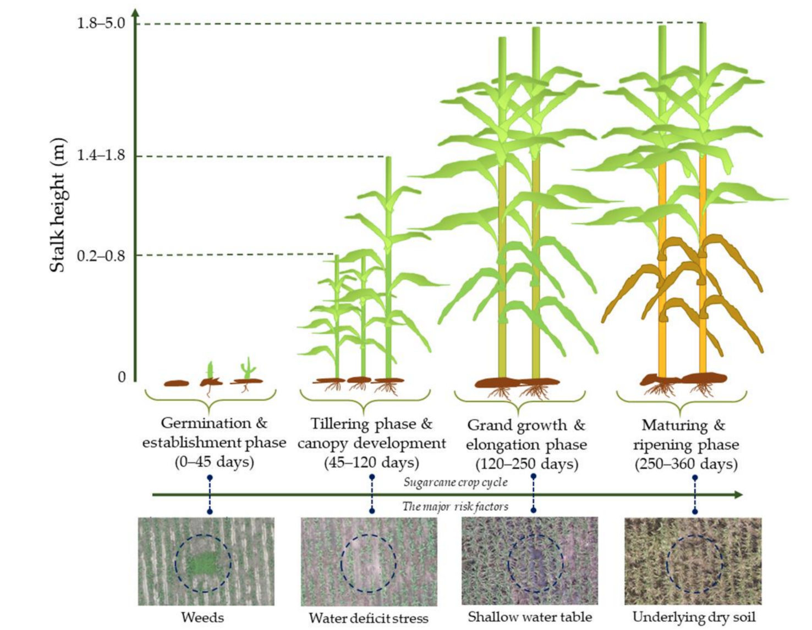
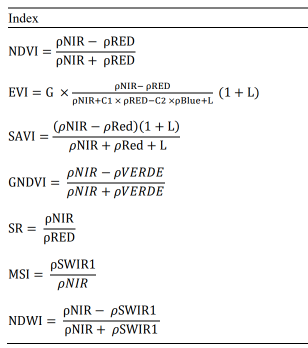
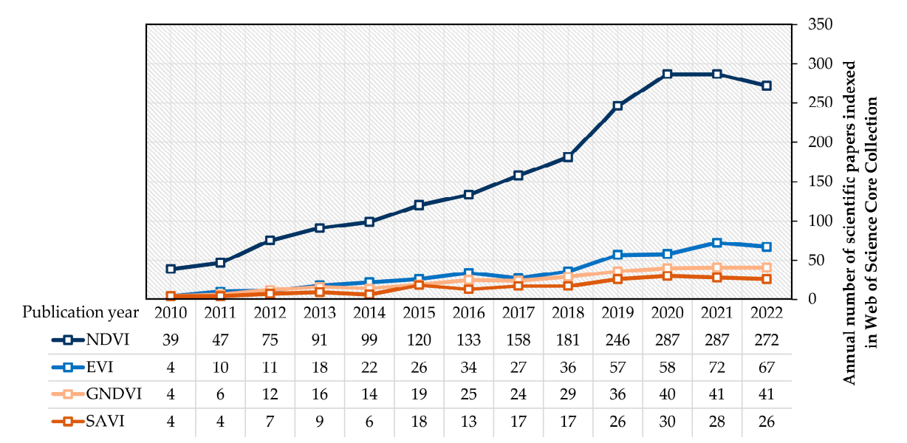
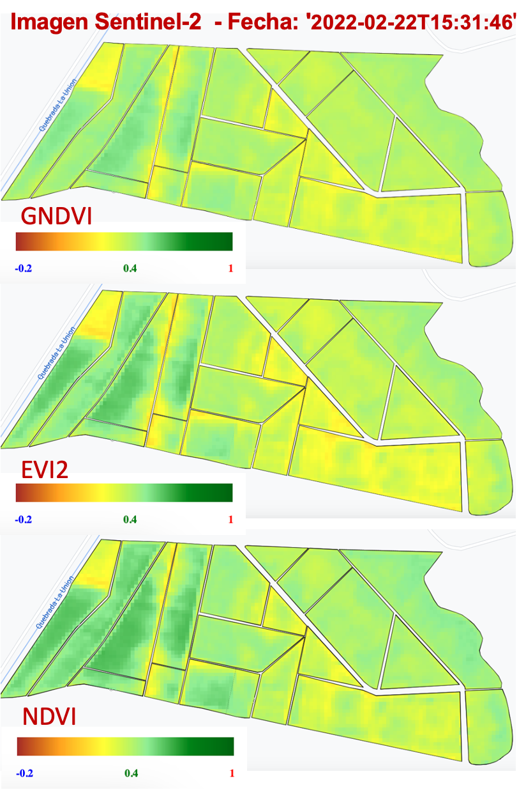
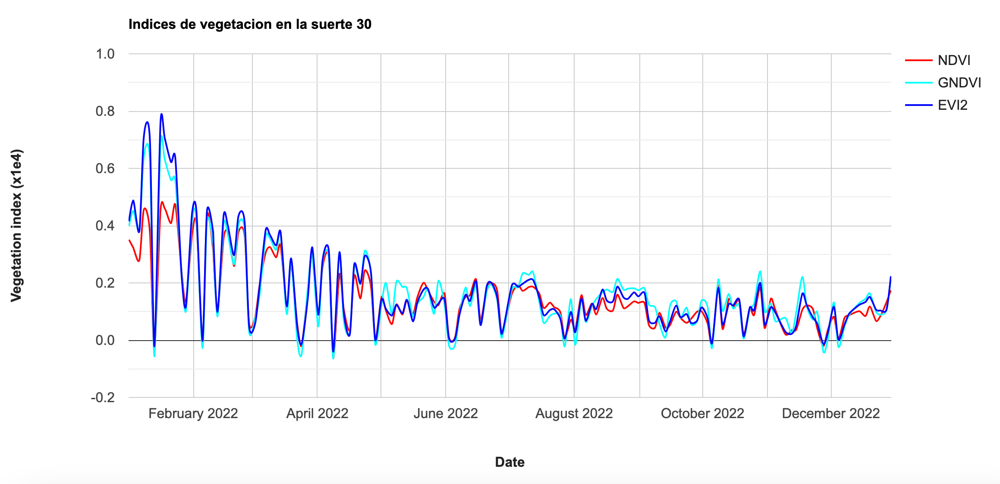

## IALS - 31.10.2023

## Indices de vegetación para el monitoreo del cultivo

La percepción remota puede contribuir a un monitoreo efectivo de las diferentes fases de cultivo de caña de la azúcar:

 

  

Una manera de hacerlo es mediante el uso de indices de vegetación. 

 

  

Sin embargo, la pregunta es ¿cuál es el indice de vegetación más apropiado para realizar seguimiento a un cultivo? 

Al respecto, se puede decir que, en principio, todos los indices son útiles. Sin embargo, solamente el uso combinado de diferentes indices y su contrastación con datos de campo permite realizar afirmaciones veraces sobre la utilidad real de uno u otro indice.

 

  

## Ejercicio: obtención de tres indices de vegetacion

En este ejercicio vamos calcular NDVI, GNDVI y EVI2 de todas las imágenes Sentinel-2 de 2022 que cubren la hacienda de interés.

El código es similar al que hemos venido practicado en ejercicios previos. Enseguida se indican cada uno de los bloque de código:


//Paso 1: Despliegue la tabla con la zona de estudio
// tabla es un objeto importado usando el shapefile de suertes de La Juana
// -----------------------------------------------------------------
var tabla = ee.FeatureCollection("users/ivanlizarazo/RIO/ste_La_Juana");

Map.centerObject(tabla,17);
Map.addLayer(tabla, {}, 'Juana');

// -----------------------------------------------------------------
//Paso 2: Acceda a la coleccion  Sentinel-2 Level-2A  
// Filtre las imagenes de 2022 
// Obtenga solamente las bandas relevantes bands and 
// Eventualmente, filtre por nubosidad
// -----------------------------------------------------------------
var s2a = ee.ImageCollection('COPERNICUS/S2_SR')
                  .filterBounds(tabla)
                  .filterDate('2022-01-01', '2022-12-31')
                  .select('B1','B2','B3','B4','B5','B6','B7','B8','B8A','B9','B11','B12');
                  //.filter(ee.Filter.lt('CLOUDY_PIXEL_PERCENTAGE', 50));

//Print your ImageCollection to your console tab to inspect it
print(s2a, 'S2 Image Collection Juana');

// funcion para recortar una imagen
function recortar(img) {
  return img.clip(tabla);
}

// iteracion sobre toda la coleccion
var aoi_S2c = s2a.map(recortar);

// imprimir el resultado
print(aoi_S2c, 'aoi_S2c');

// plotear una imagen
var una_imagen = aoi_S2c.sort('CLOUDY_PIXEL_PERCENTAGE').first();

var param1 = {bands: ["B4","B3","B2"], gamma: 1, max: 2400, min: 1300, opacity: 1}

Map.addLayer(una_imagen,param1, "una_imagen");

// -----------------------------------------------------------------
// Paso 3. Rescalar las imagenes para obtener reflectancia de superficie
// -----------------------------------------------------------------
// Al buscar en el catalogo de imagenes la coleccion "COPERNICUS/S2_SR
// se encuentran los parametros de *scale* and *offset*
var escala = 0.0001;

// funcion para rescalar una imagen
function rescalar(img) {
  return img.select('B.|B7').multiply(escala).copyProperties(img, img.propertyNames());
}

var aoi_S2r = aoi_S2c.map(rescalar);

// imprimir el resultado
print(aoi_S2r, 'aoi_S2r');

// visualizar el resultado
var param= {bands: ["B4","B3","B2"],
             gamma: 1.5,
             max: 0.28,
             min: 0.00,
             opacity: 1};

// -----------------------------------------------------------------
// Paso 4.  Obtener las fechas de las imágenes
// -----------------------------------------------------------------

// instruccion para conocer la fecha de una imagen

var fechas = aoi_S2r.aggregate_array("system:time_start");
fechas = fechas.map(function(x){return ee.Date(x)});

print(fechas, 'fechas');

// seleccionar la imagen de un dia especifico             
var una_imagen = aoi_S2r.filter(ee.Filter.date('2022-02-22T15:31:46'));

// visualizar la imagen
Map.addLayer(una_imagen, param, 'una imagen SR - 2022-02-22');
Map.addLayer(tabla, param, 'suerte');

// visualizar etiquetas
var text = require('users/gena/packages:text');
var scale = Map.getScale() * 2 ;// You can reduce 1 to 0.25 or even less if labels too big like it was for me

var labels = tabla.map(function(feat) {
  feat = ee.Feature(feat);
  var name = ee.String(feat.get("suerte")); //"Name" is the name of the column of the table of attribute of my shapefile containing the labels.
  var centroid = feat.geometry().centroid();
  var t = text.draw(name, centroid, scale, {
    fontSize:12, //looks like you cannot chose another size than 12 (but it can be scaled anyway using the var scale above
    textColor:'white',
    outlineWidth: 1.0,
    outlineColor:'black'
  });
  return t;
});

var labels_final = ee.ImageCollection(labels);
Map.addLayer(labels_final, {}, "Etiquetas de suertes");

// -----------------------------------------------------------------
// Paso 5. Calcular NDVI, GNDVI y EVI2
// -----------------------------------------------------------------

// NDVI
var getNDVI = function(image){
   var NIR = image.select('B8');
   var RED = image.select('B4');
   var NDVI = NIR.subtract(RED).divide(NIR.add(RED)).rename('NDVI');
   return image.addBands(NDVI);
};

// GNDVI
var getGNDVI = function(image){
   var NIR = image.select('B8');
   var GREEN = image.select('B3');
   var GNDVI = NIR.subtract(GREEN).divide(NIR.add(GREEN)).rename('GNDVI');
   return image.addBands(GNDVI);
};

// EVI2
var getEVI2 = function(image){
   var NIR = image.select('B8');
   var RED = image.select('B4');
   var EVI2 = NIR.subtract(RED).divide(NIR.add(RED).add(1)).multiply(2.4).rename('EVI2');
   return image.addBands(EVI2);
};

  
// iteracion sobre la coleccion de imagenes

var s2ndvi = aoi_S2r.map(getNDVI);
var s2gndvi = s2ndvi.map(getGNDVI);
var s2vi = s2gndvi.map(getEVI2);

print(s2vi, 's2evi');

var dates = s2vi.aggregate_array("system:time_start");
dates = dates.map(function(x){return ee.Date(x)});

print(dates, 'dates');
// obtener una imagen de la fecha de interes
var tres_indices = s2vi.filter(ee.Filter.date('2022-02-01', '2022-02-03'));

print(tres_indices);
// ---------------------------------------------------------------------
// Visualizar EVI
// ---------------------------------------------------------------------

// Defina la paleta de colores para EVI
var vi2Vis = {
 min: -0.2,
 max: 1,
 palette: ['brown', 'orange', 'yellow', 'lightgreen','green', 'darkgreen']
};

// Visualizar la banda NDVI
Map.addLayer(tres_indices.select('NDVI'), vi2Vis, 'ndvi de una imagen');
// Visualizar la banda EVI 
Map.addLayer(tres_indices.select('EVI2'), vi2Vis, 'evi2 de una imagen');
// Visualizar la banda GNDVI
Map.addLayer(tres_indices.select('GNDVI'), vi2Vis, 'gndvi de una imagen');

//print("una_imagen es de  fecha ", una_imagen.date());

// Create legend title
var legendTitle = ui.Label({
  value: 'EVI',
  style: {
    fontWeight: 'bold',
    fontSize: '18px',
    margin: '0 0 0 0',
    padding: '0'
    }
});
// create legendLabels
var legendLabels = ui.Panel({
    widgets: [
    ui.Label(
      vi2Vis.min
    , {margin: '4px 8px', fontSize: '11px', fontFamily: 'serif', color: 'blue', fontWeight: 'bold'}
    ),
    ui.Label(
        (0.4)
    ,{margin: '4px 8px', textAlign: 'center', stretch: 'horizontal', fontSize: '11px', fontFamily: 'serif', color: 'green', fontWeight: 'bold'}
        ),
    ui.Label(vi2Vis.max 
    ,{margin: '4px 8px', fontSize: '11px', fontFamily: 'serif', color: 'red', fontWeight: 'bold'}
    )
        ],
    layout: ui.Panel.Layout.flow('horizontal'),
    });

// create thumbnail
var thumbnail = ui.Thumbnail({
       image: ee.Image.pixelLonLat().select(0),
       params: {bbox:'0, 0, 1, 0.1', dimensions:'220x200',palette:  ['brown', 'orange', 'yellow',  
                                                                'lightgreen','green', 'darkgreen']},
       style: {stretch:'horizontal', maxHeight: '20px',padding: '1px', position: 'bottom-center'},
       });
var legendPanel = ui.Panel({widgets: [legendTitle, thumbnail, legendLabels],
                       style: {position: 'bottom-right',} 
                       });
Map.add(legendPanel);

//
// Obtener los valores de NDVI  para las suertes de Juana

var VIcol = s2vi.select(['NDVI','GNDVI', 'EVI2']);

var suerte30 = tabla.filter(
  ee.Filter.eq('suerte', '030'));
    //.or(ee.Filter.eq('COLUMN', 'VALUE2'))
    //.or(ee.Filter.eq('COLUMN', 'VALUE3')))

print(VIcol);

print(suerte30);

// Define the chart and print it to the console.
var chart =
    ui.Chart.image
        .series({
          imageCollection: VIcol,
          region: suerte30,
          reducer: ee.Reducer.mean(),
          scale: 10,
          xProperty: 'system:time_start'
        })
        .setSeriesNames(['NDVI', 'GNDVI', 'EVI2'])
        .setOptions({
          title: 'Indices de vegetacion en la suerte 30',
          hAxis: {title: 'Date', titleTextStyle: {italic: false, bold: true}},
          vAxis: {
            title: 'Vegetation index (x1e4)',
            titleTextStyle: {italic: false, bold: true}
          },
          lineWidth: 2,
          colors: ['red', 'cyan','blue'],
          curveType: 'function'
        });
print(chart);


La siguiente figura muestra tres indices de vegetacion Sentinel-2 en una fecha determinada:
 

  

El resultado es un gráfico de tres series de tiempo de índices de vegetación para la suerte de interés:

 

  

