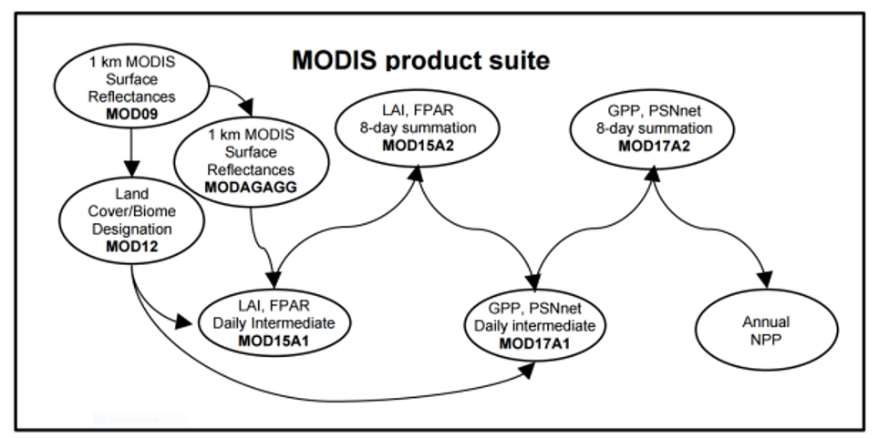
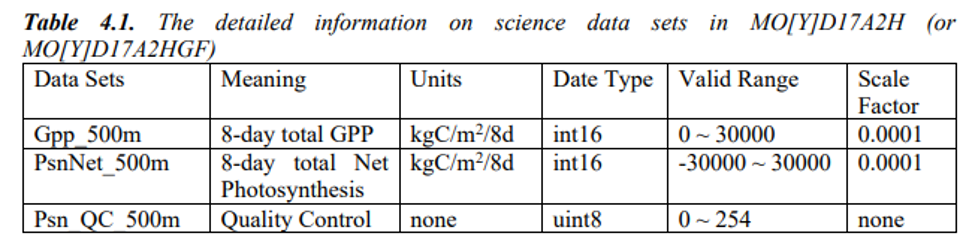
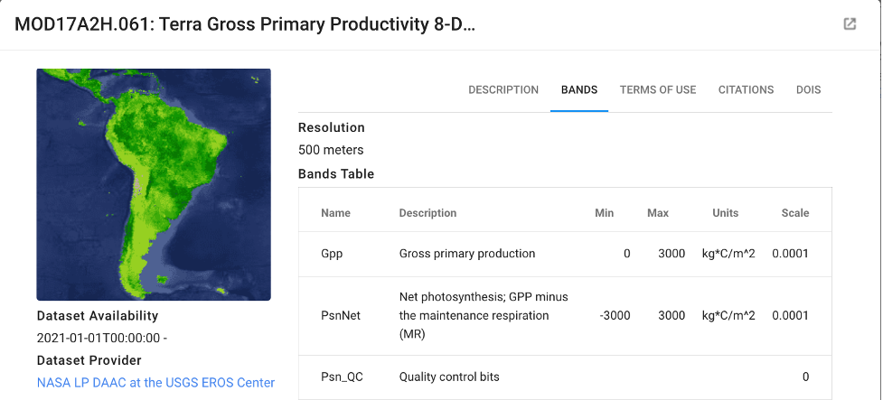
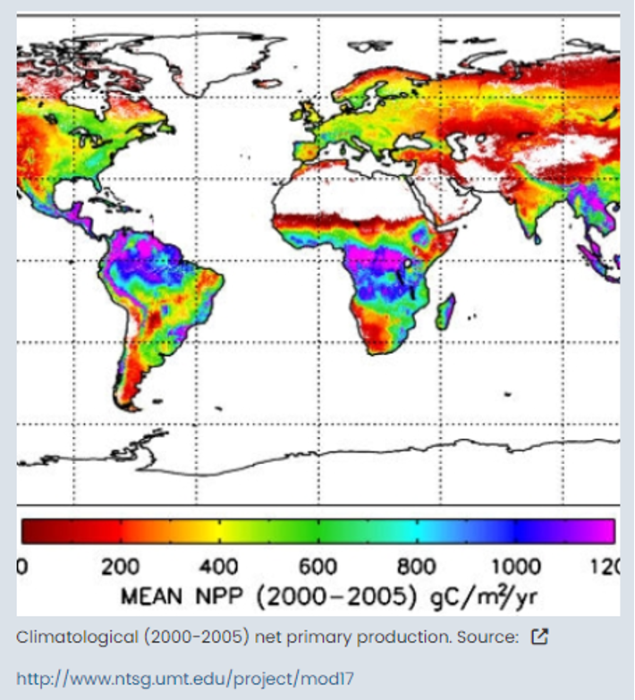
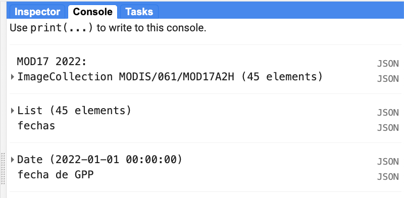
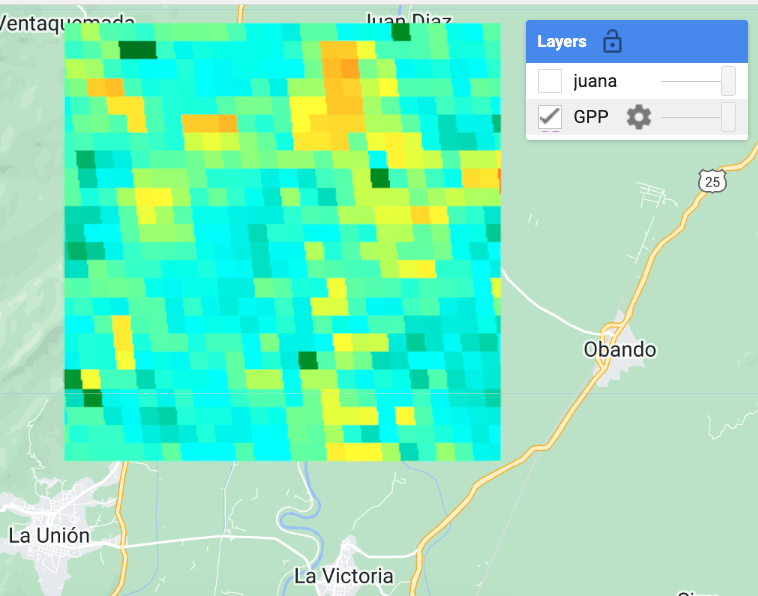
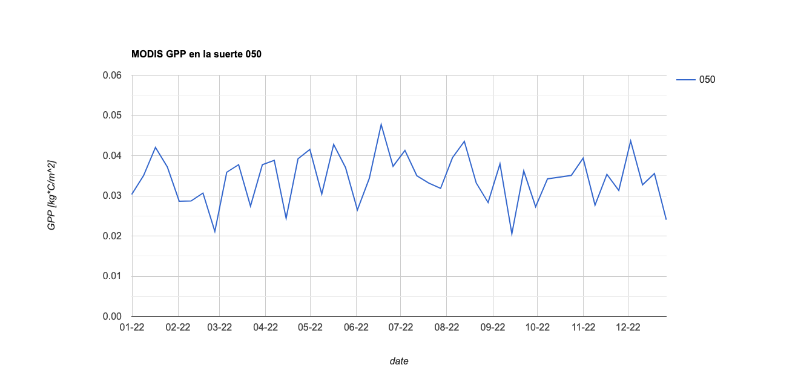

## IALS - 31.10.2023

## MODIS MOD17

Este conjunto de datos incluye valores de producción primaria bruta (GPP) derivados de las observaciones de radiancia y reflectancia de la colección 6 de los satélites Aqua y Terra de MODIS.

 

  

Cada imagen de esta colección se obtiene con una frecuencia de 8 días, tiene resolución espacial de 500 m y comprende tres bandas:

 

  

La derivación de la producción primaria bruta se basa en que:
i. GPP de las plantas está directamente relacionada con la energía solar absorbida;
ii.	NDVI y EVI obtenidos de imágenes MODIS, están relacionados con la energía solar absorbida por las plantas, y
iii. Factores biofísicos determinan la relación entre la eficiencia real y potencial de conversión de la energía solar por las plantas.

 

  

Expresado de forma muy sencilla, la fracción de radiación fotosintéticamente activa absorbida (FAPAR) puede vincularse a través de la eficiencia de las plantas para convertir la radiación solar en  crecimiento y así estimar la producción primaria. Esta eficiencia de conversión depende del tipo de bioma, del índice de área foliar y de las condiciones de evapotranspiración y respiración. 

La derivación de los dos parámetros de producción primaria GPP y NPP requieren datos sobre la cobertura terrestre, LAI, FAPAR, sueloa y condiciones atmosféricas como datos de entrada.

 

  

## Ejercicio: obtención de GPP

En este ejercicio vamos a obtener datos  GPP que cubren la zona de interés en 2022.

El código es similar al que hemos venido practicado en ejercicios previos. Enseguida se indican cada uno de los bloques de código:


//
// -----------------------------------------------------------------
//Paso 1: importe la tabla con la zona de estudio
// y la colección de interés
// -----------------------------------------------------------------

var tabla = ee.FeatureCollection("users/ivanlizarazo/RIO/ste_La_Juana");
var imgcol_8d =  ee.ImageCollection("MODIS/061/MOD17A2H")
                     .filterDate('2022-01-01', '2022-12-31').filterBounds(tabla);

imgcol_8d = imgcol_8d.select([0, 1, 2]);

print('MOD17 2022:', imgcol_8d);

// cuales son las fechas disponibles
var fechas = imgcol_8d.aggregate_array("system:time_start");
fechas = fechas.map(function(x){return ee.Date(x)});
print(fechas, 'fechas');


Al imprimir la colección y  las fechas  se puede observar que se trata de datos obtenidos cada 8 días:
 

  


/ -----------------------------------------------------------------
//Paso 2: recorte todas las imaágenes de la colección, seleccione
//la banda de interés y realice su rescalamiento
// -----------------------------------------------------------------

// zona de interes
var AOI =  ee.Geometry.Polygon(
          [[[-76.1, 4.65],
          [-76.1, 4.55],
          [-76.0, 4.55],
          [-76.0, 4.65]]]);

// funcion para recortar una imagen
function recortar(img) {
  return img.clip(AOI);
}

// iteracion sobre toda la coleccion
var img_aoi = imgcol_8d.map(recortar);

// en los metadatos se encuentra el valor de *scale* para obtener GPP
//MOD17A2H.061: 
//GPP     kg*C/m^2     0  3000  0.0001
//PsnNet	kg*C/m^2	-3000	3000	0.0001	
//Net photosynthesis; GPP minus the maintenance respiration (MR)

// funcion para rescalar una imagen
// GPP;
var escala = 0.0001;
function rescalar(img) {
  return img.select(['Gpp']).multiply(escala).copyProperties(img, img.propertyNames());
}

var img_gpp = img_aoi.map(rescalar);

//
// -----------------------------------------------------------------
//Paso 3: visualice una imagen de la colección
// -----------------------------------------------------------------
//
var gppVis = {
  min: 0,
  max: 0.06,
  palette:
      ['red', 'orange', 'yellow', 'cyan', 'green', 'blue'],
};

//imprimir fecha de la primera imagen
print(img_gpp.first().date(), 'fecha de GPP');
//visualizar la primera imagen
Map.centerObject(tabla, 12);
Map.addLayer(img_gpp.first(), gppVis, 'GPP');
Map.addLayer(tabla,{}, 'juana');



 

  


//
// -----------------------------------------------------------------
//Paso 3: Obtener los valores de GPP 2022 para una suerte
// ----------------------------------------------------------- 
// 
// Filtrar la suerte de interes
var suerte50 = tabla.filter(ee.Filter.eq('suerte', '050'));

// Plot NDVI ---------------------------------------------------------------------------------------------
var GPPChart = ui.Chart.image.seriesByRegion({
  imageCollection: img_gpp,
  regions: suerte50,
  reducer: ee.Reducer.mean(), //type of reduction. 
  scale: 500, //spatial scale of MODIS 17
  seriesProperty: 'suerte',  //property of suertes to display in map
  xProperty: 'system:time_start'
})
  .setOptions({
    title: 'MODIS GPP en la suerte 050',
    vAxis: {title: 'GPP [kg*C/m^2]', maxValue: 0.06, minValue: 0.00},
    hAxis: {title: 'date', format: 'MM-yy', gridlines: {count: 12}},
  });

print(GPPChart);


El resultado final es una serie temporal 2022 de la variable GPP para la suerte de interés:

 

  

## Limitaciones de los datos MODIS

Cómo se indicó al principio de este curso, una de las características importantes de los datos es su resolución espacial.  En el caso de los productos MOD17, el tamaño del pixel es de 500 m.  Esta resolución tiene muchas limitaciones para monitorear cultivos que tengan poca extensión.  A pesar de ello, son productos obtenidos mediante un procedimiento rigurosos y en la literatura se ha reportado su utilización en diversas aplicaciones en agricultura.

