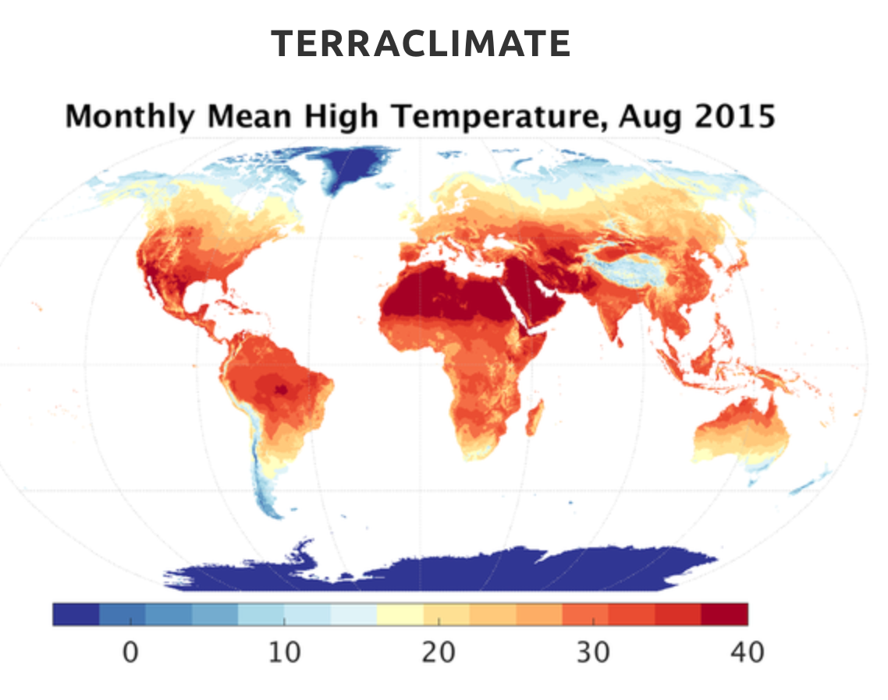
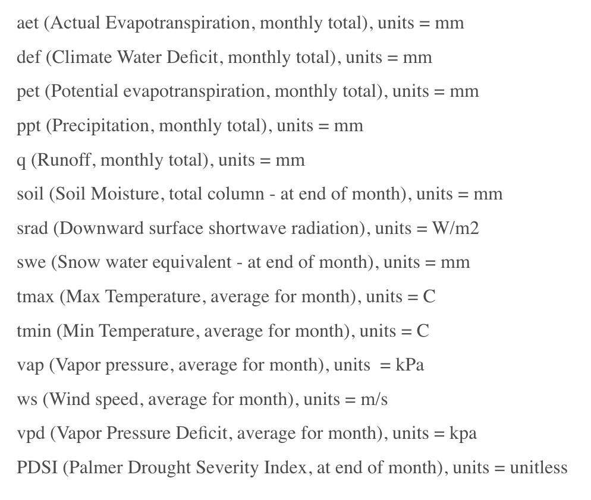
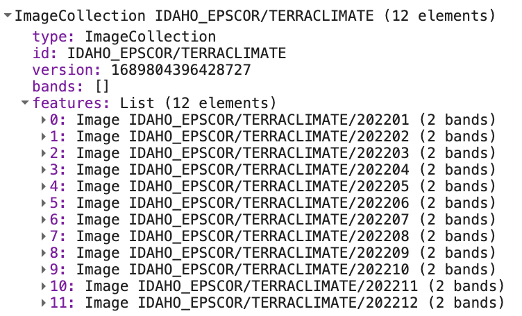
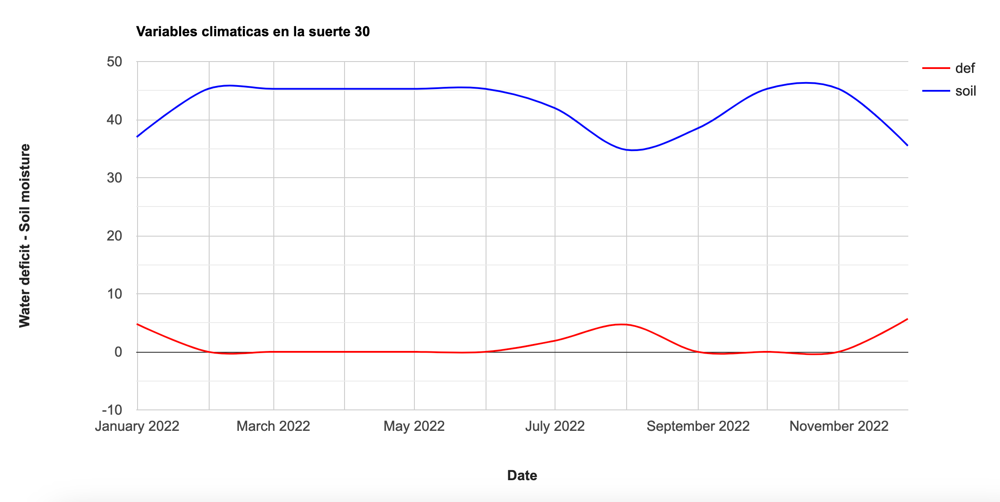
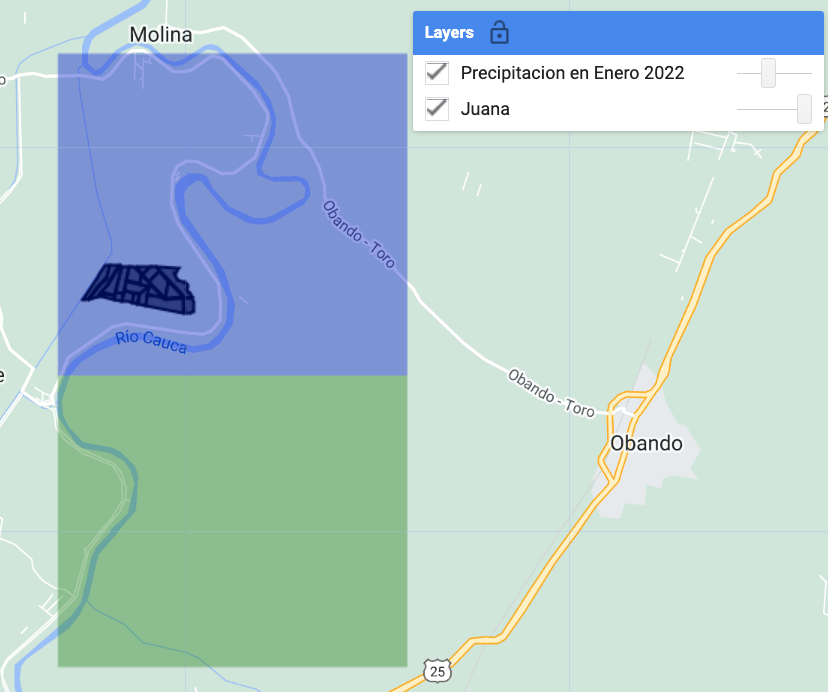

## IALS - 31.10.2023

## Terraclimate

TerraClimate es un conjunto de datos mensuales sobre el clima y el balance hídrico de las superficies terrestres del planeta. Utiliza técnicas de interpolación apoyadas por modelos climáticos, combinando normales climatológicas de 1km de resolución espacial de WorldClim, con datos de resolución espacial más gruesa pero variables en el tiempo, de CRU Ts4.0 y del Reanálisis Japonés de 55 años (JRA55). Conceptualmente, el procedimiento aplica anomalías interpoladas variables en el tiempo de CRU Ts4.0/JRA55 a la climatología de alta resolución espacial de WorldClim para crear un conjunto de datos de *5 km* de resolución espacial.

 

  

Los datos mensuales de Terraclimate incluyen diferentes variables:

 

  

## Ejercicio: obtención de dos variables climáticas

En este ejercicio vamos a obtener datos mensuales de las variables "deficit de agua" (def) y "humedad del suelo" (soil) que cubren la hacienda de interés correspondientes al año 2022.

El código es similar al que hemos venido practicado en ejercicios previos. Enseguida se indican cada uno de los bloque de código:


/* 
/Obtención de variables climáticas 
//
// Autor: Ivan Lizarazo
// Fecha: 31-10-2023
//
//
Objetivo: obtener algunas variables climáticaa para una zona de interés
Módulo Tutorial Completo: https://ials.github.io/GEE_BASICO/07-TerraClimate/

Temas tratados: 
  - acceso a la coleccion de datos de TerraClimate
  - obtener tres series multitemporales para un periodo de tiempo determinado
  - visualizar los resultados
  - exportar las series de tiempo
*/
//
// -----------------------------------------------------------------
//Paso 1: Despliegue la tabla con la zona de estudio
// tabla es un objeto importado usando el shapefile de suertes de La Juana
// -----------------------------------------------------------------
var tabla = ee.FeatureCollection("users/ivanlizarazo/RIO/ste_La_Juana");

var tc = ee.ImageCollection("IDAHO_EPSCOR/TERRACLIMATE");

Map.centerObject(tabla,17);
Map.addLayer(tabla, {}, 'Juana');

// -----------------------------------------------------------------
//Paso 2: Acceda a la coleccion de datos TerraClimate
// Filtre las imagenes de 2022 
// Obtenga solamente las bandas de balance de agua (def) y humedad del suelo (soil)
// -----------------------------------------------------------------
var tc = tc.filterBounds(tabla)
                  .filterDate('2022-01-01', '2022-12-31')
                  .select('def','soil');
  

//Print your ImageCollection to your console tab to inspect it
print(tc, 'Terraclimate variables');

// funcion para recortar una imagen
function recortar(img) {
  return img.clip(tabla);
}

// iteracion sobre toda la coleccion
var aoi_tc = tc.map(recortar);

// imprimir el resultado
print(aoi_tc, 'aoi_tc');

// -----------------------------------------------------------------
// Paso 3. Rescalar las imagenes para obtener las variables de interes
// -----------------------------------------------------------------
// En los metadatos de TerraClimate
// se encuentra el valor de *scale* para obtener las dos variables en mm
var escala = 0.1;

// funcion para rescalar una imagen
function rescalar(img) {
  return img.select(['def','soil']).multiply(escala).copyProperties(img, img.propertyNames());
}

var aoi_dosvar = aoi_tc.map(rescalar);

// imprimir el resultado
print(aoi_dosvar, 'aoi_dosvar');

// -----------------------------------------------------------------
// Paso 4.  Obtener las fechas de las imágenes
// -----------------------------------------------------------------

// instruccion para conocer la fecha de una imagen

var fechas = aoi_dosvar.aggregate_array("system:time_start");
fechas = fechas.map(function(x){return ee.Date(x)});

print(fechas, 'fechas');

// seleccionar la imagen de un dia especifico             
//var una_imagen = aoi_dosvar.filter(ee.Filter.date('2022-02-22T15:31:46'));

// visualizar la imagen
//Map.addLayer(una_imagen, param, 'una imagen SR - 2022-02-22');
//Map.addLayer(tabla, param, 'suerte');

//print("una_imagen es de  fecha ", una_imagen.date()); 

// -----------------------------------------------------------------
// Paso 5.  Obtener las series temporales
// -----------------------------------------------------------------

var suerte30 = tabla.filter(
  ee.Filter.eq('suerte', '030'));
    //.or(ee.Filter.eq('COLUMN', 'VALUE2'))
    //.or(ee.Filter.eq('COLUMN', 'VALUE3')))

// Define the chart and print it to the console.
var chart =
    ui.Chart.image
        .series({
          imageCollection: aoi_dosvar,
          region: suerte30,
          reducer: ee.Reducer.mean(),
          scale: 10,
          xProperty: 'system:time_start'
        })
        .setSeriesNames(['def', 'soil'])
        .setOptions({
          title: 'Variables climaticas en la suerte 30',
          hAxis: {title: 'Date', titleTextStyle: {italic: false, bold: true}},
          vAxis: {
            title: 'Water deficit - Soil moisture',
            titleTextStyle: {italic: false, bold: true}
          },
          lineWidth: 2,
          colors: ['red', 'blue'],
          curveType: 'function'
        });
print(chart);



Al imprimir la colección de datos de TerraClimate para la zona de interés se puede observar que se trata de datos mensuales correspondientes a las dos bandas seleccionadas:
 

  

El resultado final es un gráfico de los valores mensuales en 2022 de las variables "water deficit" [mm] y "soil moisture" [mm] para la suerte de interés:

 

  

## Limitaciones de los datos disponibles en TerraClimate

Cómo se indicó al principio de este curso, una de las características importantes de los datos es su resolución espacial.  En el caso de Terraclimate, ella es de aprox. 5km.  Esta resolución plantea muchas limitaciones respecto a su utilidad.  Visualicemos una variable climática para ilustrar este aspecto.


// Paso 6.  Visualizar una variable en una fecha de interes
// -----------------------------------------------------------------
// -----------------------------------------------------------------
// Definir parametros de visualizacion.
var prVis = {
  min: 0.0,
  max: 100.0,
  palette: ['red', 'orange', 'yellow','cyan', 'green', 'blue']  
};
// Seleccionar la variable de interes
var pr =  tc.select('pr'); // "pr" es precipitacion acumulada

// Definir la zona de interes
AOI =  ee.Geometry.Polygon(
        [[[-76.04, 4.62],
          [-76.04, 4.55],
          [-76.00, 4.55],
          [-76.00, 4.62]]], null, false);
// Recortar a la zona 
function recortar(img) {
  return img.clip(AOI);
}
var pr_aoi = pr.map(recortar);
// Seleccionar la fecha de interes
var sr_ene = pr_aoi.filter(ee.Filter.date('2022-01-01', '2022-01-02'));
Map.centerObject(suerte30, 13);
Map.addLayer(sr_ene, prVis, 'Precipitacion en Enero 2022');


 

  