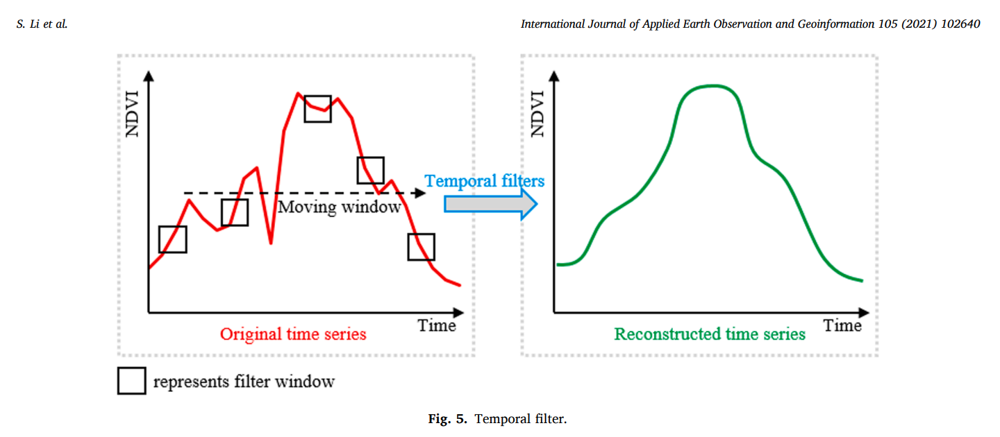
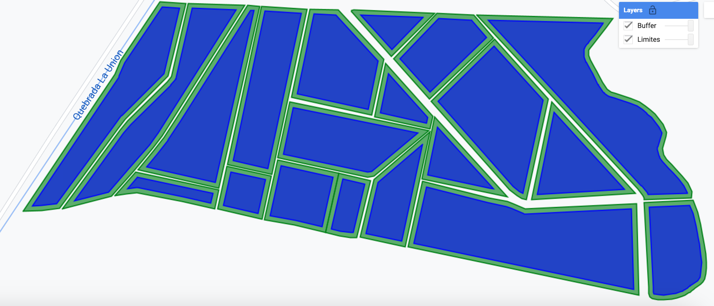
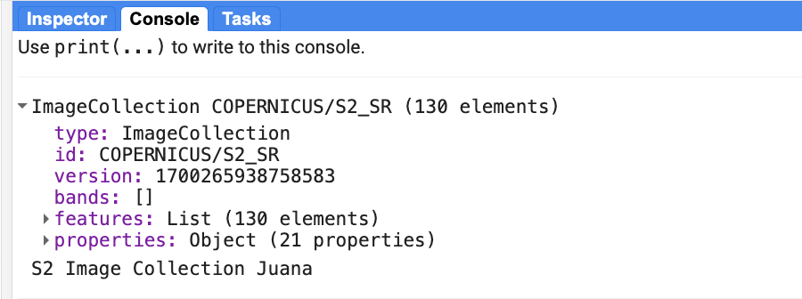
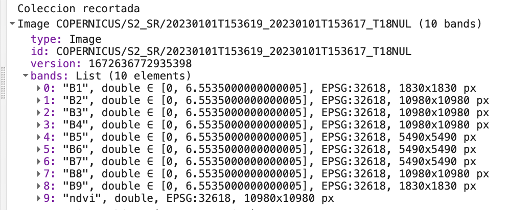
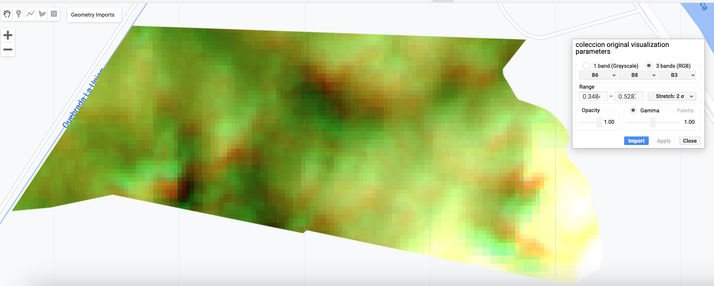
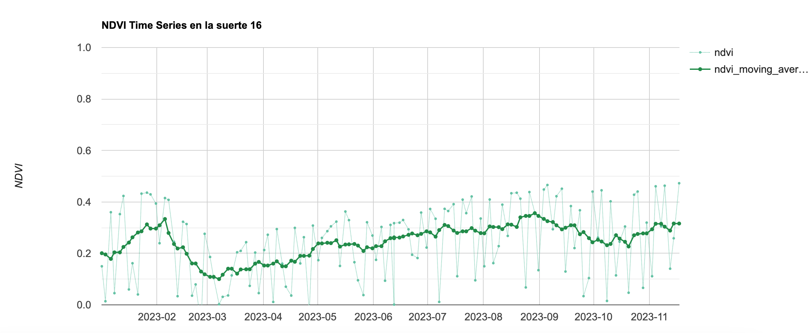

## IALS - 17.11.2023

## Reconstruccion de series temporales de NDVI 

En una serie de tiempo de NDVI (o de otro indice multiespectral) existe "contaminación" debida a dispersión atmosférica, cobertura de nubes, fallas de los sensores, entre otros factores. Por ello, es recomendable reducir el "ruido" antes de utilizar la serie de tiempo para analizar el objeto de estudio. 

Una de las técnicas utilizadas para "reconstruir" series temporales es el denominado filtro móvil que calcula un valor promedio en una "ventana temporal" alrededor de cada uno de los valores de la serie.  La intención de esta operación de filtrado es suavizar la serie para que ella pueda representar consistentemente la curva fenológica de crecimiento de la vegetación.

La figura siguiente muestra el principio del filtrado temporal:

 

  

## Ejercicio: suavizado de NDVI 

En este ejercicio vamos a obtener una serie temporal de NDVI y a realizar su reconstrucción.

Enseguida se indican cada uno de los pasos a seguir. Luego de cada bloque de código se visualizan los resultados correspondientes:

### 1. Definir la zona de interes

Luego de iniciar sesión en GEE, hay que cargar la zona de interés (importando un shapefile como activo de cada usuario). Luego, hay que crear un nuevo script y guardarlo en el directorio de trabajo.


//
// -----------------------------------------------------------------
//Paso 1: Defina la zona de estudio
// 
// -----------------------------------------------------------------

// importe la tabla que contiene las suertes de interés
var tabla = ee.FeatureCollection("users/ivanlizarazo/RIO/ste_La_Juana");

// Aplique un buffer negativo a la geometria
var geometryBuff = tabla.geometry().buffer(-10)

// Centre el mapa en la zona de interés
Map.centerObject(tabla,16.5);

// Agregue la zona de interés y el buffer al mapa
// and specify fill color and layer name
Map.addLayer(tabla,{color:'green'},'Limites');
Map.addLayer(geometryBuff,{color:'blue'},'Buffer');


El resultado es el siguiente:
 

  

### 2. Crear una coleccion de imagenes Sentinel-2 

Al cargar una colección de imágenes, es conveniente remover los datos contaminados por presencia de nubes y de sombras. En este paso vamos a usar un filtro basado en los datos de la banda SCL que contiene una asignación de pixeles a ciertas clases como vegetación y suelos.


//
// ------------------------------------------------------------------------
//Paso 2: Cargue la colección de imágenes de Sentinel-2
// (seleccione 
// ------------------------------------------------------------------------
// importar la coleccion de imagenes
var s2a = ee.ImageCollection('COPERNICUS/S2_SR')
                  .filterBounds(tabla)
                  .filterDate('2023-01-01', '2023-11-20');

// imprimir la coleccion en la consola y chequear sus propiedades
print(s2a, 'S2 Image Collection Juana');

// funcion para recortar una imagen
function recortar(img) {
  return img.clip(juana);
}

// iteracion de la funcion anterior sobre toda la coleccion
var aoi_S2c = s2a.map(recortar);


Al imprimir la colección se observa que existen 130 imagenes Sentinel-2 adquiridas en 2023 y que cada una de ellas consta de 23 bandas:
 

  

### 3. Calcular el indice de vegetacion NDVI

En este paso vamos a usar la coleccion de imagenes reescalada y recortada para calcular el indice NDVI basado en los valores de reflectancia en la banda roja  (band 4) y en la banda infraroja cercana (band 8).


// ---------------------------------------------------------------------
// Paso 3. Rescalar las imagenes para obtener reflectancia de superficie
// ---------------------------------------------------------------------
// Al buscar en el catalogo de imagenes la coleccion "COPERNICUS/S2_SR
// se encuentran los parametros de *scale* and *offset*
var escala = 0.0001;

// funcion para rescalar una imagen
function rescalar(img) {
  return img.select('B.|B7').multiply(escala).copyProperties(img, img.propertyNames());
}

// aplicacion de la funcion
var aoi_S2r = aoi_S2c.map(rescalar);

// -----------------------------------------------------------------
// Paso 4. Calcular el indice de vegetacion de interes
// -----------------------------------------------------------------

// Funcion para calcular NDVI
var getNDVI = function(image){
   var NIR = image.select('B8');
   var RED = image.select('B4');
   var NDVI = NIR.subtract(RED).divide(NIR.add(RED)).rename('ndvi');
   return image.addBands(NDVI);
};

// Funcion para enmascarar nubes y sombras
function maskClouds(image) {
  var cloudProb = image.select('MSK_CLDPRB');
  var cloud = cloudProb.lt(5);
  var scl = image.select('SCL'); 
  var shadow = scl.eq(3); // 3 = cloud shadow
  var cirrus = scl.eq(10); // 10 = cirrus
  // Cloud probability less than 5% or cloud shadow classification
  var mask = (cloud.and(cirrus.neq(1)).and(shadow.neq(1)));
  return image.updateMask(mask);
}

//  Make S2 Image Collection 

var originalCol = aoi_S2r
  //.filter(ee.Filter.lt('CLOUDY_PIXEL_PERCENTAGE', 30))
  //.map(maskClouds)
  .map(getNDVI);
  
print ('Coleccion recortada', originalCol.first());

Map.addLayer(originalCol.first(), {}, 'coleccion original');


Observe que en cada una de las imagenes hay una banda adicional con el nombre *ndvi*:
 

  

Cambie los parametros de visualización para que la imagen se vea similar a la siguiente figura:
 

  

### 4. Reconstruir la serie temporal de NDVI

Enseguida podemos suavizar la serie temporal de NDVI usando un filtro de "ventana móvil":


//
// ------------------------------------------------------------------------
//Paso 5: Suavizado de la serie temporal del NDVI
//  
// ------------------------------------------------------------------------
// Moving-Window Smoothing

// Specify the time-window
var days = 15;

// Convert to milliseconds 
var millis = ee.Number(days).multiply(1000*60*60*24);

// We use a 'save-all join' to find all images 
// that are within the time-window

// The join will add all matching images into a
// new property called 'images'
var join = ee.Join.saveAll({
  matchesKey: 'images'
});

// This filter will match all images that are captured
// within the specified day of the source image
var diffFilter = ee.Filter.maxDifference({
  difference: millis,
  leftField: 'system:time_start', 
  rightField: 'system:time_start'
});

var joinedCol = join.apply({
  primary: originalCol, 
  secondary: originalCol, 
  condition: diffFilter
});

print('Joined Collection', joinedCol);

// Each image in the joined collection will contain
// matching images in the 'images' property
// Extract and return the mean of matched images
var extractAndComputeMean = function(image) {
  var matchingImages = ee.ImageCollection.fromImages(image.get('images'));
  var meanImage = matchingImages.reduce(
    ee.Reducer.mean().setOutputs(['moving_average']))
  return ee.Image(image).addBands(meanImage)
}

var smoothedCol = ee.ImageCollection(
  joinedCol.map(extractAndComputeMean));

print('Smoothed Collection', smoothedCol);

// Seleccionar los dos indices
var dos_ndvi = smoothedCol.select(['ndvi', 'ndvi_moving_average'])
                 .copyProperties(smoothedCol);

print('dos_ndvi', dos_ndvi);

// Primero seleccionamos  la suerte de interes 
var suerte16 = tabla.filter(ee.Filter.eq('suerte', '016'));

// Define the chart and print it to the console.

// Display a time-series chart
var chart_NDVI = ui.Chart.image.series({
  imageCollection: dos_ndvi,
  //region: geom,
  region: suerte16,  //geom
  reducer: ee.Reducer.mean(),
  scale: 20
}).setOptions({
      title: 'NDVI Time Series en la suerte 16',
      interpolateNulls: true, //false
      vAxis: {title: 'NDVI', viewWindow: {min: 0, max: 1}},
      hAxis: {title: '', format: 'YYYY-MM'},
      lineWidth: 1,
      pointSize: 4,
      series: {
        0: {color: '#66c2a4', lineDashStyle: [1, 1], pointSize: 2}, // NDVI Original
        1: {color: '#238b45', lineWidth: 2 }, // NDVI Reconstruido
      },

    });
print(chart_NDVI);



Al plotear la serie con los dos indices de la serie  se obtiene la siguiente figura:
 

  

Si es el caso, descargue la serie en formato CSV.

