## IALS - 10.11.2023

## Indice de vegetación a partir de imágenes Sentinel-2

En la sesión pasada observamos que los indices de vegetacion pueden contener valores atipicos que pueden ser causados por la presencia de nubes o de sombras.

 
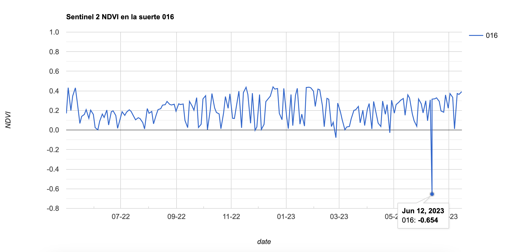
  

En la serie temporal de NDVI se observa un valor atípico de -0.65 en la fecha 12 de Junio de 2023. Al observar la imagen NDVI de dicha fecha no es evidente cuál es la causa de ese valor negativo:

 
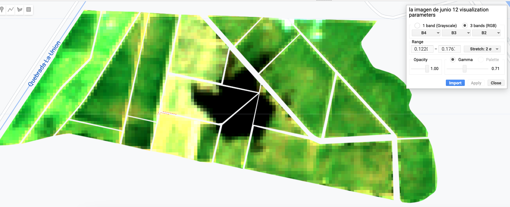
  

## Ejercicio: obtención de NDVI sin nubes

En este ejercicio intentaremos obtener una serie temporal de NDVI que no tenga nubes.

Enseguida se indican cada uno de los pasos a seguir. Luego de cada bloque de código se visualizan los resultados correspondientes:

### 1. Definir la zona de interes

Luego de iniciar sesión en GEE, hay que cargar la zona de interés (importando un shapefile como activo de cada usuario). Luego, hay que crear un nuevo script y guardarlo en el directorio de trabajo.


//
// -----------------------------------------------------------------
//Paso 1: Defina la zona de estudio
// 
// -----------------------------------------------------------------

// importe la tabla que contiene las suertes de interés
var tabla = ee.FeatureCollection("users/ivanlizarazo/RIO/ste_La_Juana");

// Aplique un buffer negativo a la geometria
var geometryBuff = tabla.geometry().buffer(-10)

// Centre el mapa en la zona de interés
Map.centerObject(tabla,16.5);

// Agregue la zona de interés y el buffer al mapa
// and specify fill color and layer name
Map.addLayer(tabla,{color:'green'},'Limites');
Map.addLayer(geometryBuff,{color:'red'},'Buffer');


El resultado es el siguiente:
 
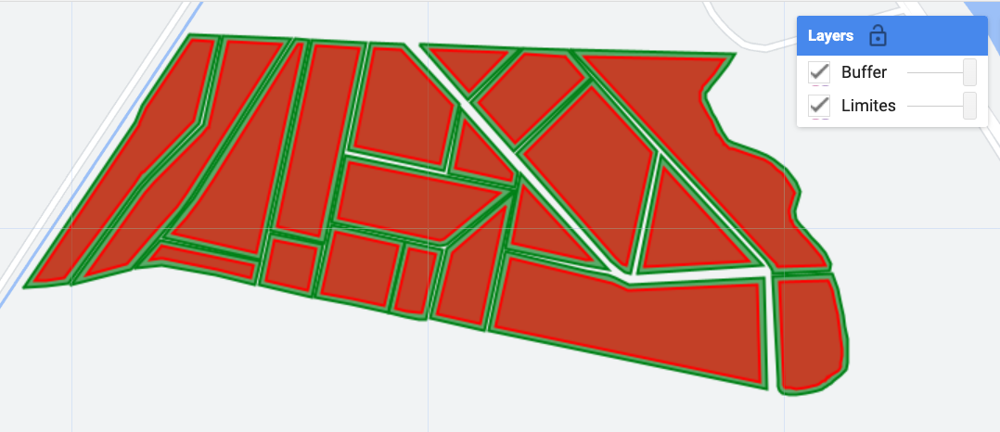
  

### 2. Crear una coleccion de imagenes Sentinel-2 

Al cargar una colección de imágenes, es conveniente remover los datos contaminados por presencia de nubes y de sombras. En este paso vamos a usar un filtro basado en los datos de la banda SCL que contiene una asignación de pixeles a ciertas clases como vegetación y suelos.


//
// ------------------------------------------------------------------------
//Paso 2: Cargue la colección de imágenes de Sentinel-2
// (seleccione 
// ------------------------------------------------------------------------
// Primero seleccionamos S2_SR que son imágenes de reflectancia de superficie 
var S2 = ee.ImageCollection('COPERNICUS/S2_SR') 
  // Remove cloudy images from the collection
  //.filterMetadata('CLOUDY_PIXEL_PERCENTAGE', 'less_than', 20)
  // Filter to study period
  .filterDate('2022-06-01', '2023-07-31')
  // Filter to plot boundaries
  .filterBounds(geometryBuff);

//
// Enseguida podemos crear una funcion para trabajar con los pixeles
// que corresponde a vegetación y suelo desnudo
// Esta informacion está en la banda SCL (Scene Classification Layer) 
// 
function keepFieldPixel(image) {
  // Select SCL layer
  var scl = image.select('SCL'); 
  // Select vegetation and soil pixels
  var veg = scl.eq(4); // 4 = Vegetation
  var soil = scl.eq(5); // 5 = Bare soils
  // Mask if not veg or soil
  var mask = (veg.neq(1)).or(soil.neq(1));
  return image.updateMask(mask);
}

// Ahora aplicamos la funcion anterior a la colección S2
var S2 = S2.map(keepFieldPixel);

// Tambien podemos crear una funcion para filtrar las nubes usando la banda QA60

function maskS2clouds(image) {
  var qa = image.select('QA60');

  // Bits 10 and 11 are clouds and cirrus, respectively.
  var cloudBitMask = 1 << 10;
  var cirrusBitMask = 1 << 11;

  // Both flags should be set to zero, indicating clear conditions.
  var mask = qa.bitwiseAnd(cloudBitMask).eq(0)
      .and(qa.bitwiseAnd(cirrusBitMask).eq(0));

  return image.updateMask(mask);
}
// Note que aunque la funcion maskS2clouds se creó
// no se ha aplicado todavía
//
// Vamos a imprimir la colección S2
print(S2, 'Coleccion S2');


Al imprimir la colección se observa que hay 168 imagenes y que cada una consta de 23 bandas:
 
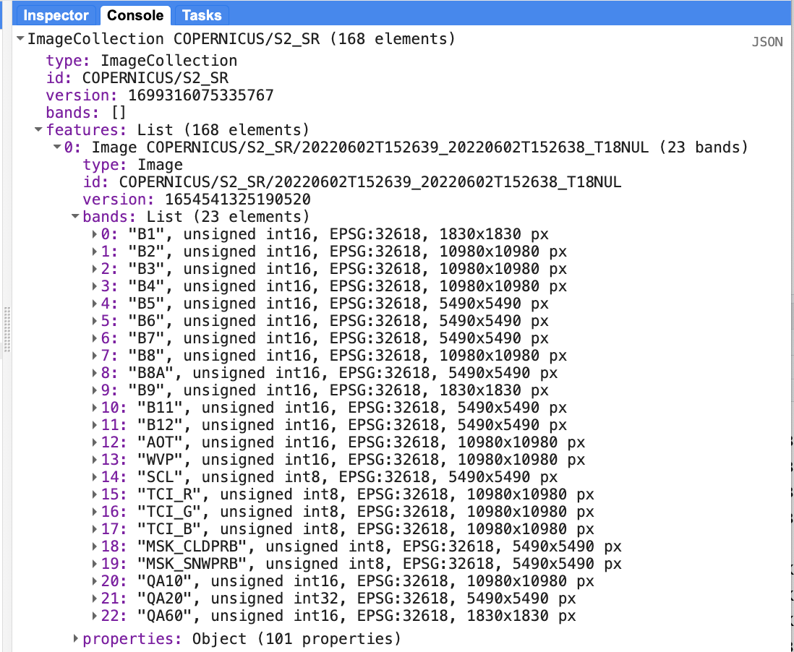
  

### 3. Calcular el indice de vegetacion NDVI

En este paso vamos a calcular el indice NDVI basado en los valores de reflectancia en la banda roja  (band 4) y en la banda infraroja cercana (band 8).


//
// ------------------------------------------------------------------------
//Paso 3: Cálculo del indice de vegetacion NDVI 
//  
// ------------------------------------------------------------------------

// Funcion para calcular NDVI y agregar el resultado como una banda nueva
var addNDVI = function(image) {
return image.addBands(image.normalizedDifference(['B8', 'B4']).rename("NDVI"));
};

// Calculo de NDVI en cada imagen y adicion a la coleccion 
var S2 = S2.map(addNDVI);

// Impresion de la  coleccion. "aumentada"
// 
print(S2, 'Coleccion S2 aumentada');


Observe que en cada una de las 168 imagenes hay una banda adicional con el nombre NDVI:
 
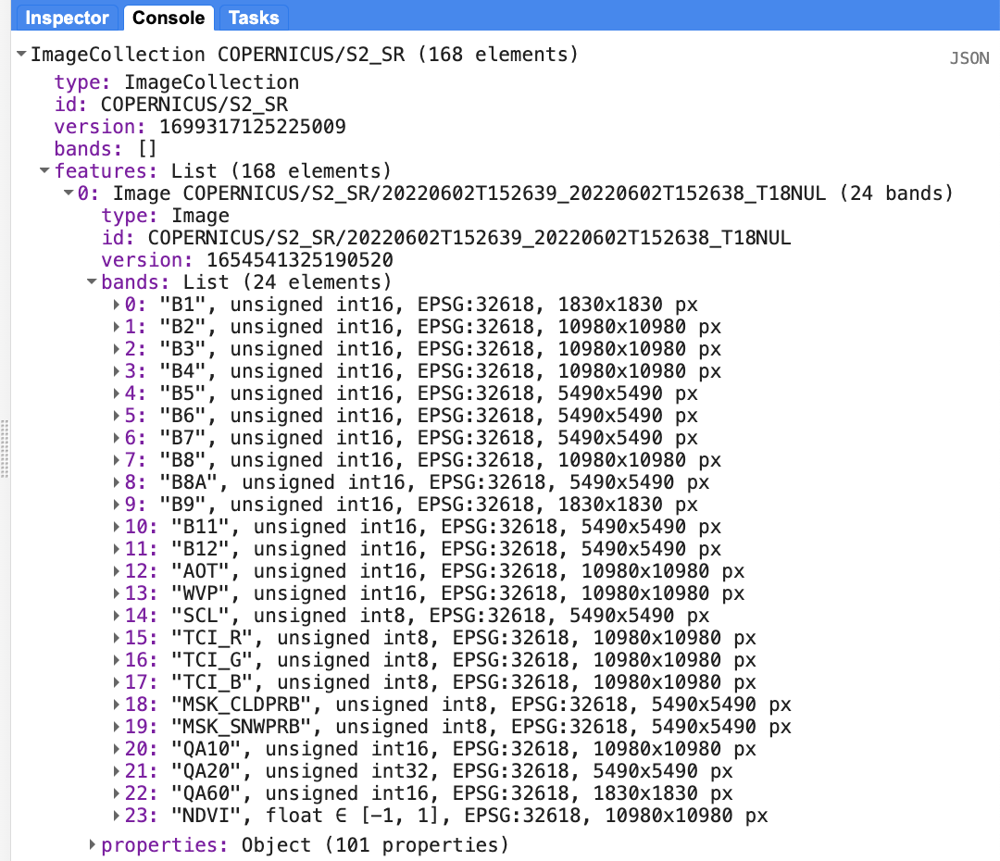
  

### 4. Plotear la serie temporal de NDVI

Enseguida podemos calcular el valor promedio de NDVI, en cada fecha, en la suerte de interés:


//
// ------------------------------------------------------------------------
//Paso 4: Cálculo del NDVI promedio en la suerte de interés  
//  
// ------------------------------------------------------------------------
// 
// Primero tenemos que seleccionar la suerte 
suerte16 = tabla.filter(ee.Filter.eq('suerte', '016'))

// Luego obtener la serie temporal en esa suerte
var evoNDVI = ui.Chart.image.seriesByRegion(
  S2,                // Image collection
  suerte16,      // Region
  ee.Reducer.mean(), // Type of reducer to apply
  'NDVI',              // Band
  10);               // Scale

// Enseguida creamos la funcion para plotear el resultado
var plotNDVI = evoNDVI                    // Data
    .setChartType('LineChart')            // Type of plot
    .setSeriesNames(['SCL filter only'])
    .setOptions({                         // Plot customization
      interpolateNulls: true,
      lineWidth: 1,
      pointSize: 3,
      title: 'NDVI variacion en la suerte 016',
      hAxis: {title: 'Fecha'},
      vAxis: {title: 'NDVI'}
});
// Imprimir
print(plotNDVI)


Al plotear la serie  se obtiene la siguiente serie de tiempo:
 

  

Observe que el NDVI de Junio 12 de 2022 tiene un valor atípico.

### 5. Remoción de nubes

Para limpiar nuestra series, vamos a aplicar el segundo filtro que definimos en el paso 2 (maskS2clouds) y que busca eliminar los pixeles con presencia de nubes.


//
// ------------------------------------------------------------------------
//Paso 5: Eliminación de pixeles cubiertos por nubes  
//  
// ------------------------------------------------------------------------
// Aplicacion del segundo filtro
var S2 = S2.map(maskS2clouds);

// Funcion de ploteo 
var plotNDVI2 = ui.Chart.image.seriesByRegion(
  S2, 
  suerte16,
  ee.Reducer.mean(),
  'nd',10)
  .setChartType('LineChart')
  .setSeriesNames(['After cloud filter'])
  .setOptions({
    interpolateNulls: true,
    lineWidth: 1,
    pointSize: 3,
    title: 'NDVI variacion en la suerte 016',
    hAxis: {title: 'Fecha'},
    vAxis: {title: 'NDVI'},
    series: {0:{color: 'red'}}
  });

// ploteo
print(plotNDVI2)


Al plotear la nueva serie  se obtiene el siguiente grafico:
 
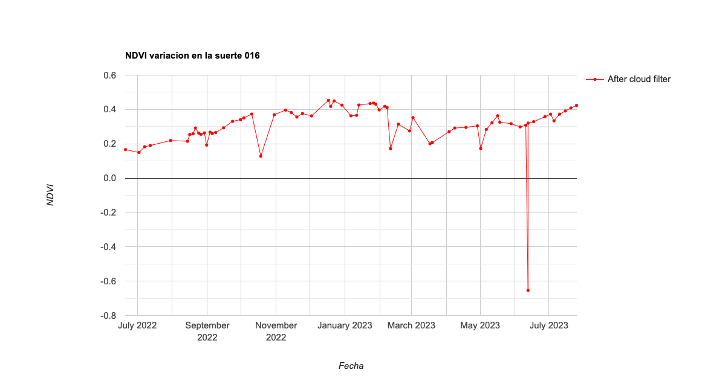
  

Como puede observarse, el valor atípico no ha desaparecido. Esto indica que tal vez  dicho valor no es causado por nubes ni sombras.

### 6. Visualizacion de NDVI en una fecha de interes

En este paso intentaremos clarificar qué esta pasando en Junio 12:


//
// ------------------------------------------------------------------------
//Paso 6A: Visualizacion de NDVI en una fecha de interes  
//  
// ------------------------------------------------------------------------
// 
// Extract NDVI band from S2 collection 
var NDVI = S2.select(['NDVI']);
// Extract NDVI value for 12 Junio
var NDVIjunio12 = NDVI.filterDate('2023-06-12', '2023-06-13'); 

// Revision de la imagen de Junio 12
var listOfImages = NDVIjunio12.toList(NDVIjunio12.size());
print('Lista:',listOfImages);


Lo primero que causa extrañeza es saber que existen dos imágenes Sentinel-2 tomadas el mismo día.

 
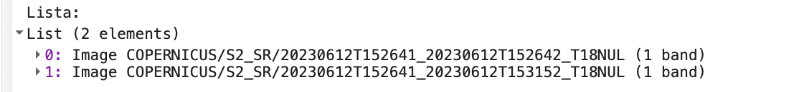
  

Enseguida, vamos a visualizar los dos NDVI de esa fecha:


//
// ------------------------------------------------------------------------
//Paso 6B: Visualizacion de los dos NDVI  
//  
// ------------------------------------------------------------------------
var ndvi1 = ee.Image(listOfImages.get(0));

var ndvi2 = ee.Image(listOfImages.get(1));

// Hex values for red to green color palette
var pal = ['#d73027', '#f46d43', '#fdae61', '#fee08b', '#d9ef8b', '#a6d96a'];

// Display NDVI results on map
Map.addLayer(
  ndvi1.clip(suerte16),        // Clip map to plot borders
  {min:0.0, max:0.6, palette: pal},  // Specify color palette 
  'NDVI 1 - Junio 12'                             // Layer name
  );
  
Map.addLayer(
  ndvi2.clip(suerte16),        // Clip map to plot borders
  {min:0.0, max:0.6, palette: pal},  // Specify color palette 
  'NDVI 2 - Junio 12'                             // Layer name
  );


El "primer"" NDVI de Junio 12 parece que representa una ínfima parte de la suerte 016:
 
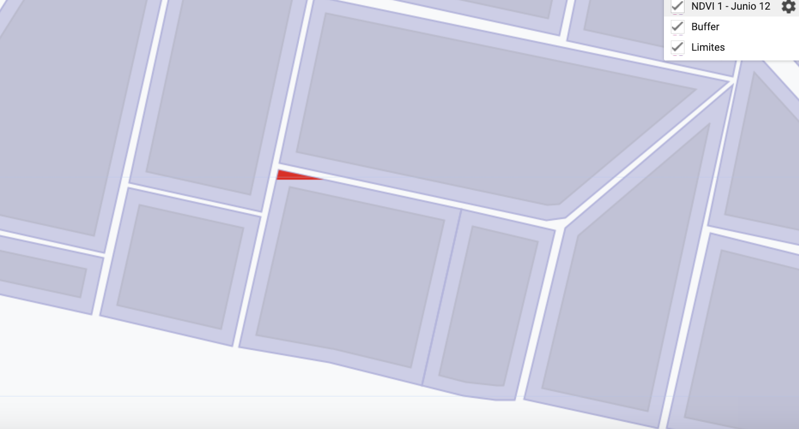
  

El "segundo"" NDVI de Junio 12 luce mejor:
 
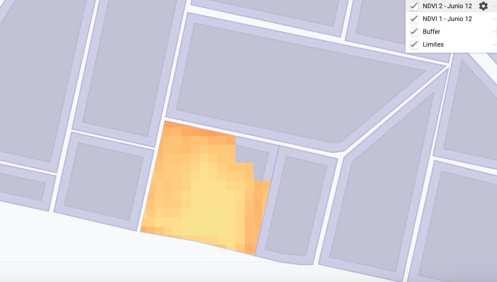
  

Ahora es una buena idea visualizar la "primera" imagen de Junio 12:


//
// ------------------------------------------------------------------------
//Paso 6C: Visualizar la primera imagen de Junio 12   
//  
// ------------------------------------------------------------------------
// plotear la imagen Sentinel-2 de Junio 12
var UnaS2 = S2.filterDate('2023-06-12', '2023-06-13');

Map.addLayer(
  UnaS2.first(),        // Seleccione la primera
  {},  // Specify color palette 
  'Una S2 - Junio 12'                             // Layer name
  );


Examinemos la "primera" imagen Sentinel-2  de Junio 12, para entender qué es lo que pasa:
 
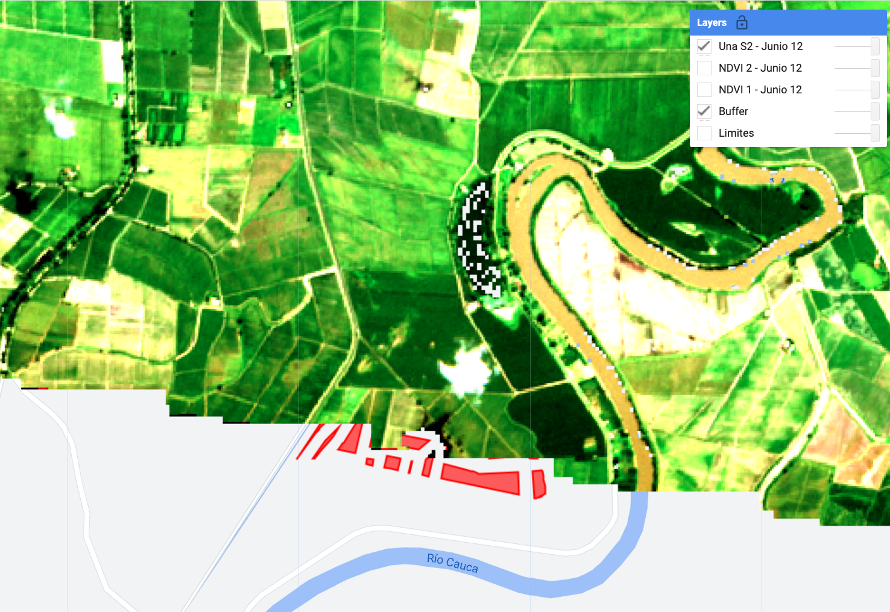
  

Ahora queda claro que está pasando: la hacienda de interés está en una zona de traslapo entre escenas!

### 7. Exportacion de imagenes NDVI durante un periodo determinado 


//
// ------------------------------------------------------------------------
//Paso 7: Exportacion de imagenes NDVI   
//  
// ------------------------------------------------------------------------
//  
//importar una libreria que permite descargar varias imagenes
var batch = require('users/fitoprincipe/geetools:batch')
//
// funcion para recortar una imagen
function recortar(img) {
  return img.clip(tabla);
}

// recortar todas las imagenes de la coleccion
var NDVItabla =  NDVI.map(recortar);

// realizar un subset para exportar
var NDVIsubset = NDVItabla.filterDate('2023-05-30', '2023-06-30');

var count = NDVIsubset.size();
print("NDVI Collection", count);

// exportar la coleccion a google drive
batch.Download.ImageCollection.toDrive(
  NDVIsubset, 
 'RIO', 
  {name: 'ndvi_{system:index}',
  crs: 'EPSG: 3115',
  type: 'float',
  scale:  10,
  region: tabla});


Como resultado del bloque anterior, se han creado algunas "tareas de exportación" que deben ejecutarse una por una:
 
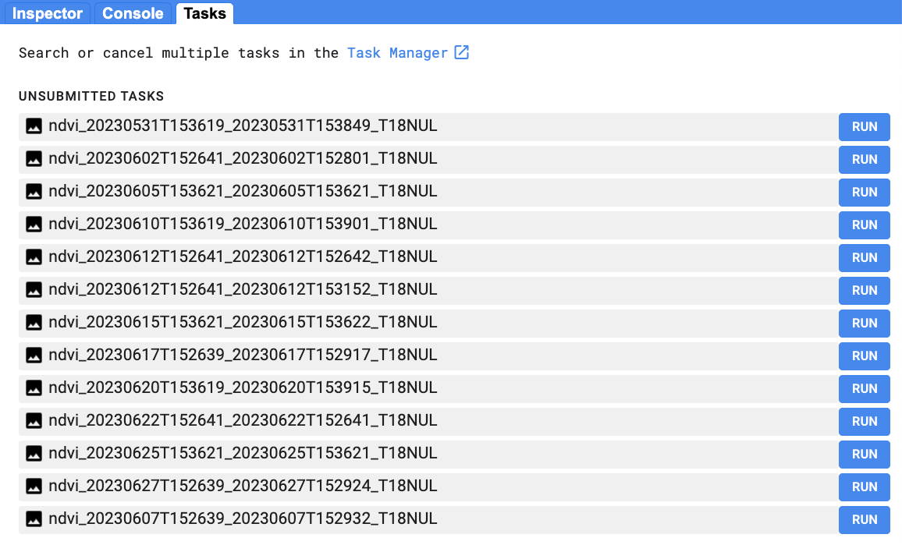
  

Una vez que las tareas se hayan ejecutado, tenemos que ir a la carpeta *RIO* de nuestro google drive y descargar todas las imágenes para posterior análisis en un programa SIG (p.ej. QGIS):

Una imagen NDVI de Junio 12:

 
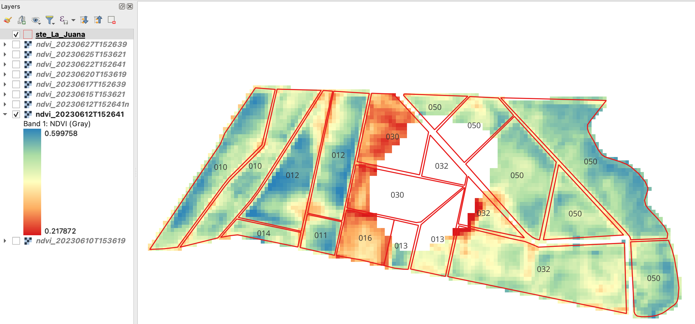
  

Otra imagen NDVI de Junio 12:
 
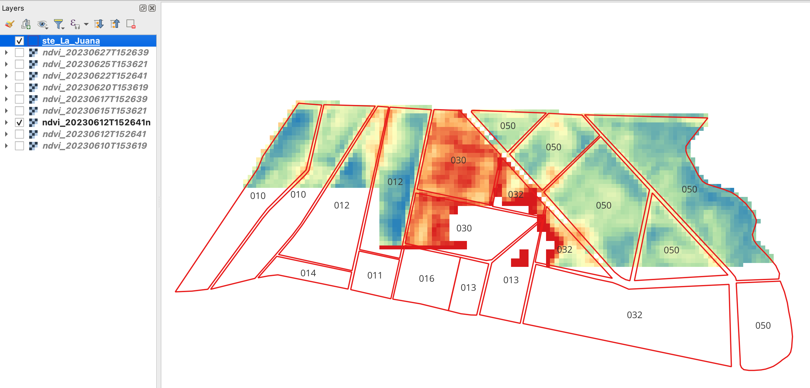
  

